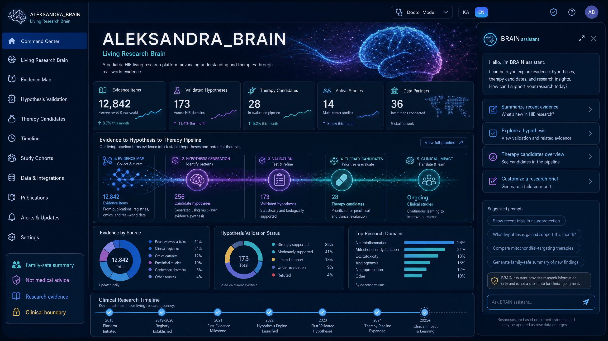
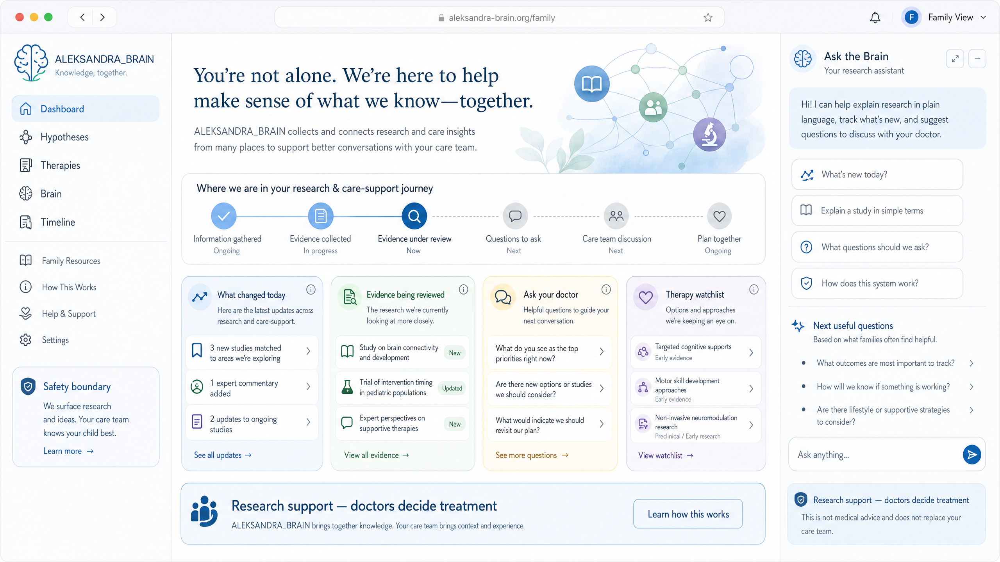
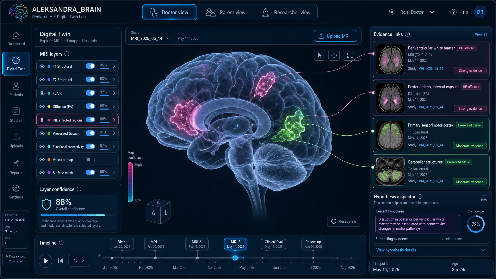

# ALEKSANDRA_BRAIN_v4 — შიგთავსისა და დიზაინის რეკომენდაცია

## მთავარი შეფასება

არსებული საიტი უკვე შეიცავს სწორ არქიტექტურულ იდეებს: dashboard, hypotheses, therapies, brain viewer და timeline. პრობლემა ის არის, რომ შიგთავსი და ვიზუალური ენა ჯერ არ აჩვენებს პროექტის მთავარ ძალას. მომხმარებელი ხედავს ცალკეულ გვერდებს, ცარიელ ბარათებს და ტექნიკურ მდგომარეობას, მაგრამ ვერ ხედავს ერთიან სურათს: **როგორ გარდაქმნის ALEKSANDRA_BRAIN კვლევას, მტკიცებულებებს, ჰიპოთეზებს და თერაპიულ იდეებს პრაქტიკულ ცოდნად**.

საიტი უნდა გადავიყვანოთ developer prototype-ის განცდიდან product experience-ში. ამისთვის საჭიროა სამი ხედის მკაფიო გამოყოფა: **doctor/research mode**, **family-safe mode** და **digital twin/brain lab mode**. ამ სამი ხაზის გაერთიანება აჩვენებს როგორც ადამიანურ მნიშვნელობას, ისე ტექნიკურ სიღრმეს.

| პრობლემა არსებულ შიგთავსში | რატომ ასუსტებს საიტს | პრაქტიკული გამოსავალი |
| --- | --- | --- |
| ბევრი ბარათი ცარიელია ან technical placeholder-ს აჩვენებს | მომხმარებელი ვერ ხედავს პოტენციალს | sample/demo state, guided empty-state და „რისთვის არის ეს გვერდი“ explanation |
| dashboard არ ჰყვება ისტორიას | ჩანს სტატისტიკა, მაგრამ არა workflow | Evidence → Hypothesis → Therapy → Timeline pipeline-ის გამოკვეთა |
| Brain გვერდი ვიზუალურად ყველაზე სუსტი placeholder-ია | სწორედ ეს გვერდი უნდა იყოს პროექტის „wow moment“ | 3D brain viewer-ის mock state, layer controls და evidence links |
| Family-facing ენა სუსტად ჩანს | მშობლისთვის სისტემა შეიძლება ზედმეტად ტექნიკური ჩანდეს | family-safe dashboard, plain-language summaries და doctor questions |
| safety boundary საკმარისად prominent არ არის | სამედიცინო სფეროში trust კრიტიკულია | მუდმივი „research support — doctors decide treatment“ ბლოკი |

## დიზაინის სამი შემოთავაზებული მიმართულება

### Concept A — Clinical Intelligence Command Center

ეს მიმართულება საიტს აჩვენებს როგორც **research-grade clinical intelligence platform-ს**. მთავარი აქ არის evidence pipeline: მტკიცებულებების შეგროვება, ჰიპოთეზების გენერაცია/ვალიდაცია, therapy candidates და timeline. ეს ყველაზე ძლიერი მიმართულებაა ექიმებისთვის, მკვლევრებისთვის და curator workflow-სთვის.

### Concept B — Family-Safe Research Journey

ეს მიმართულება უკეთ პასუხობს იმ ემოციურ და პრაქტიკულ საჭიროებას, რაც ოჯახს აქვს. ტექსტები არ ჰგავს სამედიცინო სისტემის შიდა მონაცემებს; ისინი პასუხობს კითხვებს: „რა შეიცვალა დღეს?“, „რა მტკიცებულებები განიხილება?“, „რა ვკითხოთ ექიმს?“ ეს დიზაინი კარგი საფუძველია homepage-ის ან family mode-ისთვის.

### Concept C — Digital Twin Brain Lab

ეს არის ყველაზე ძლიერი ვიზუალური კონცეფცია ALEKSANDRA_BRAIN-ის უნიკალურობის საჩვენებლად. 3D brain viewer, MRI layers, affected/preserved regions, evidence links და role-based tabs ქმნის განცდას, რომ პროექტს აქვს არა მხოლოდ dashboard, არამედ **ცოცხალი ციფრული კვლევითი გარემო**.

## ჩემი რეკომენდაცია

საუკეთესო შედეგისთვის არ ავირჩევდი მხოლოდ ერთ დიზაინს. პრაქტიკულად ყველაზე ძლიერი სტრატეგია არის **ჰიბრიდული IA/UI მოდელი**: homepage და family view უნდა წავიდეს Concept B-ის მშვიდი, გასაგები ენით; dashboard და hypotheses უნდა განვითარდეს Concept A-ის research command center ლოგიკით; ხოლო Brain გვერდი უნდა გახდეს Concept C-ის immersive centerpiece.

| საიტის ნაწილი | რეკომენდებული დიზაინის ხასიათი | მიზანი |
| --- | --- | --- |
| Home / Landing | Concept B + მოკლე product storytelling | სწრაფად ახსნას რა არის სისტემა და რატომ არის მნიშვნელოვანი |
| Dashboard | Concept A | აჩვენოს მთლიანი research/clinical intelligence მდგომარეობა |
| Hypotheses | Concept A | ჰიპოთეზების ვალიდაციის workflow გახადოს გასაგები და actionable |
| Therapies | Concept A-ის უფრო clinical card layout | კანდიდატები, evidence strength და safety status გამოკვეთოს |
| Brain | Concept C | შექმნას პროექტის მთავარი ვიზუალური და ტექნოლოგიური შთაბეჭდილება |
| Timeline | Concept B + clinical event stream | ოჯახის და ექიმისათვის მარტივად აჩვენოს ისტორია და ცვლილებები |

## შემდეგი პრაქტიკული sprint

შემდეგი ნაბიჯი შეიძლება იყოს რეალურ frontend-ში ახალი design system-ის შეტანა. პირველ sprint-ში გირჩევ შემდეგს: homepage-ის rewriting, reusable `PageHero`, `InsightCard`, `SafetyBoundary`, `BrainAssistantPanel`, `EvidencePipeline` კომპონენტების შექმნა და demo/sample state-ის დამატება, რათა საიტმა მონაცემების არქონის დროსაც აჩვენოს თავისი შესაძლებლობები. ამის შემდეგ შეიძლება Brain გვერდის ვიზუალური prototype-ის აშენება Concept C-ის მიმართულებით.

