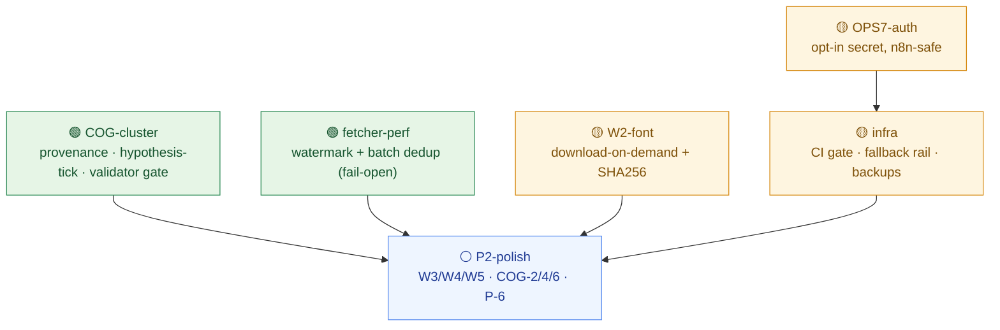

# ALEKSANDRA_BRAIN — გადასინჯული საინჟინრო გეგმა (Revised Implementation Plan)
### დარჩენილი roadmap-ის ინოვაციური ამოხსნა · ადვერსარიულად გადამოწმებული · 2026-06-13

> ეს დოკუმენტი აგრძელებს `docs/ENGINEERING-ROADMAP.md`-ს. P0/P1-ის ოთხი ყველაზე მწვავე საკითხი — **P-1** (relevance JSONB ავარია), **W1** (manager-ის ქართული briefing), **OPS-2** (heartbeat), **OPS-3** (budget ერთი წყარო) — უკვე commit-ულია. აქ **დარჩენილ** items-ს ვწერთ: გუნდმა თითო კლასტერისთვის ინოვაციური დიზაინი ააგო, შემდეგ ცალკე verifier-მა ცოცხალ კოდზე გადაამოწმა და defect-ები დააბრუნა — ეს ფიქსები უკვე ჩაქსოვილია ქვემოთ. ფაქტი არ გამოგონილა; თითო ნაბიჯი კონკრეტულ ფაილსა და ხაზს უკავშირდება.
>
> სტატუს-იარლიყები: 🟢 ცოცხალი/მზადაა და გადამოწმებულია · 🟡 აწყობილია, ერთ ფიქსს ან ერთ toggle-ს ელოდება · ⚪ დაგეგმილია.

---

## 1. რა შეიცვალა — ერთი აბზაცი

ამ რაუნდის მთავარი მონაპოვარია, რომ **ორი ჭეშმარიტი blocker ინოვაციურად გაიხსნა**, ისე რომ არცერთ ცოცხალ DB-ს არ ვეხებით ტესტირებაში. (1) **W2 — ქართული PDF font** აღარ მოითხოვს repo-ში binary-ის ჩაბმას: `brain/common/ka_font.py` ფონტს **download-on-demand**-ით იღებს, **hardcoded SHA256**-ით ამოწმებს (provenance / do-not-fabricate) და gitignored cache-ში ინახავს — corrupt/MITM download **ხმამაღლა** ვარდება, არასოდეს ჩუმად tofu-ად. (2) **OPS-7 — endpoint auth** აღარ მოითხოვს deploy-ის კოორდინაციას: ერთი `_require_auth()` gate enforce-ს **მხოლოდ მაშინ** აკეთებს, როცა secret დაყენებულია (`hmac.compare_digest`), წინააღმდეგ შემთხვევაში დღევანდელ ღია ქცევას ინარჩუნებს — ხოლო header-ი იმავე commit-ში ემატება crons-ს, ასე რომ n8n **არასოდეს** იტეხება. ორივე insight ერთ რამეს იზიარებს დანარჩენ კლასტერებთან: **ყველაფერი pure-logic-ად იქცა, რომელსაც transport-mock-ით offline ვტესტავთ** — live-DB smoke რჩება Shako-only და skip-დება როცა creds არ არსებობს. ერთადერთი დიზაინი, რომელიც verifier-მა `sound:false`-ად მონიშნა (P2-ის W3 ნაწილი), ქვემოთ **გასწორებული** ფორმითაა — ცდომილი წანამძღვარი ჩავანაცვლეთ კოდის რეალური ფაქტით.

---

## 2. გახსნილი blocker-ები

### 🟡 W2 — ქართული font binary-ის ჩაბმის გარეშე

**Insight:** არ ჩავაბათ ფონტი repo-ში — **provision** ვუყოთ. `ensure_ka_font()` პინ-დებული Noto Sans Georgian (OFL) URL-დან იღებს `.ttf`-ს, hardcoded SHA256-ით ამოწმებს, gitignored `brain/assets/fonts/`-ში ქეშავს, შემდეგ `pdfmetrics.registerFont(TTFont(...))` + `registerFontFamily`-ს იძახის. checksum არის **do-not-fabricate გარანტია**: დაზიანებული download `FontProvisionError`-ით ვარდება, არასოდეს ჩუმად box-glyph-ად. ეს ხსნის იმ workaround-ს, რომელსაც `weekly_brief.py:618-619` დღეს იძახდა („ReportLab-ის default fonts Mkhedruli-ს არ ხატავს, ამიტომ მხოლოდ EN half იხატება") — ახლა KA half-იც იხატება. offline-by-default: cold cache + ქსელი გათიშული → ხილულად ვარდება (strict) ან `None`-ს აბრუნებს (graceful EN-only fallback) — არასოდეს ჩუმი tofu.

**Verifier-ის ორი ფიქსი ჩაქსოვილია:** (1) `TTFont(name, path)` **კონსტრუქტორში** parse-ს აკეთებს და არა-parseable bytes-ზე `TTFError`-ს ისვრის *სანამ* `registerFont` დაიძახება — ამიტომ registration-ის ტესტი **რეალურ** parseable TTF-ს უნდა აჭამოს. ReportLab თავად აბრუნებს `reportlab/fonts/Vera.ttf`/`VeraBd.ttf`-ს (CI-ში უკვე არსებობს) — fake `_download` ამ ფაილებს კოპირებს tmp_path-ში, runtime-ზე ითვლის მათ sha256-ს და monkeypatch-ავს pin-ს. W2 mandate ხელუხლებელია: არც Noto binary, არც committed binary, არც ქსელი. (2) `TTFError` **არ** მემკვიდრეობს `OSError`-ს — ამიტომ `except (FontProvisionError, OSError, URLError)` მას ვერ დაიჭერდა და checksum-ის გავლის შემდეგ corrupt bytes-ი `strict=False`-ზეც კი uncaught crash-ად გამოვიდოდა. ფიქსი: `from reportlab.pdfbase.ttfonts import TTFError` და except-tuple-ში ჩამატება + `urllib.error.URLError`-ის ცხადი იმპორტი.

### 🟡 OPS-7 — opt-in auth, რომელიც n8n crons-ს არ ტეხს

**Insight:** ერთი `_require_auth()` `_Handler`-ზე secret-ს fallback-ჯაჭვით resolve-ს: `PERCEPTION_WORKER_AUTH_TOKEN or PHASE5_WORKER_AUTH_TOKEN or PHASE4_WORKER_AUTH_TOKEN`, და enforce-ს **მხოლოდ მაშინ** აკეთებს, როცა resolved value არა-ცარიელია (`hmac.compare_digest`), თორემ `True`-ს აბრუნებს — დღევანდელი open-relay ქცევა, ნულოვანი breakage. რეკონცილიაცია თავად ჯაჭვია: სამივე ისტორიული სახელი მიიღება, ამიტომ არც უკვე deploy-ული `PHASE5_WORKER_AUTH_TOKEN`, არც `PHASE4`-workflows არ იტეხება. **კრიტიკული:** რადგან `PHASE5_WORKER_AUTH_TOKEN` უკვე დაყენებულია Railway-ზე, enforcement ფაქტობრივად live ხდება ამ commit-ის გაშვებისთანავე — ამიტომ **იმავე** PR-ში ემატება `X-Auth-Token` header-ი 3 headerless cron-ს (perception/chunking/extraction), empty-safe (`|| ''`) იმავე secret-ზე. Header + gate ერთად ჯდება: race არ არის, downtime არ არის.

**Verifier-ის კორექციები:** verdict — `sound:true`, offline ✅. ფიქსები არა-blocking, მაგრამ ჩავწეროთ: (1) S7-ის *rationale* ცდებოდა — n8n unset env-ს **ცარიელ string-ად** render-ს და არა literal expression-ად; ფიქსი თავად სწორია (`telegram_daily_digest.json` active:true-ა და იმავე worker-ის `/fire-daily-batch`-ს ურტყამს, ამიტომ chain-ზე გადაწერა აუცილებელია). (2) RISK 1 გადაჭარბებული იყო — perception/chunking/extraction crons დღეს `active:false`-ა და `PERCEPTION_WORKER_URL` არ არის set; S4/S5/S6 forward-prep-ია, არა emergency. ერთადერთი ცოცხალი gated handler-ები: `telegram_daily_digest` (`/fire-daily-batch`) და `weekly_brief` (`/render-weekly-brief`). (3) **მნიშვნელოვანი ოპერაციული note:** Vercel-ის 5 route (`viewer/app/api/manager/*`) და `manager_briefing.json` `PHASE5`-ს hardcode-ენ — **PHASE5 არ უნდა წაიშალოს**, მხოლოდ PERCEPTION უნდა *დაემატოს*, თორემ ისინი 401-ს მიიღებენ.

---

## 3. კლასტერები

### 🟢 COG-cluster — COG-5 + COG-1 + COG-3 (provenance · hypothesis leg · validator gate) · effort: M

**Innovation:** მთელი კლასტერი ერთ რეალიზაციაზე იხსნება — provenance **უკვე დეტერმინისტულია**. `_call_claude` იძახის `call_llm(task="got", complexity=len(user))`, რომელიც მოდელს იმავე pure ფუნქციით resolve-ს — `models.model_for("got", complexity=len(user))`. ამიტომ fabricated კონსტანტის ნაცვლად რეალურ slug-ს ვძაფავთ `run_first`-დან `_insert_hypotheses`-ში — live call არ სჭირდება, pure-ია, სრულად offline unit-testable. „auto-trigger needs deployed crew" იხსნება CrewAI-ის **გაუცოცხლებლად**: თხელი `/hypothesis-tick` endpoint არსებულ budget-gate + handler pattern-ს იყენებს, ხოლო „token burn"-ის guard ხდება pure watermark — `evidence_ledger`-ის row count (`count=exact` + `Range:0-0`) vs `kv_state` watermark. validator (COG-3) @tool-დან გამოდის pure `validate()`-ად, ასე რომ insert path თვითონ promote-ს `new → under_review`-ს.

**ნაბიჯები:**
- `scripts/hypothesis/got_pipeline.py` — წაშალე fabricated `MODEL="claude-sonnet-4-5"` (ხ.53); `run_first`-ში `resolved_model = model_for("got", complexity=len(user))` და `_insert_hypotheses(parsed, generated_by=resolved_model)`; `"generated_by": generated_by` ხ.305-ზე.
- `scripts/verify_phase2.py` — `check_gate_c`-ში `n_sonnet` → `n_thinker`, `startswith(("anthropic/claude-opus","claude-opus","deepseek/deepseek-v4-pro"))`; label „generated by thinker tier (Opus 4.8 / V4 Pro)"; ზღურბლი `>= 3` უცვლელი.
- `scripts/hypothesis/validate.py` (new) — pure `validate(h, *, ledger_ids=None, entity_match=None) -> dict`; 5 წესი `hypothesis_tools.py:64-125`-დან verbatim. I/O-დამოკიდებული 2 წესი pre-fetched args-ად (None → False, არსებული ცარიელ-ლისტ semantics).
- `agents/tools/hypothesis_tools.py` — `validate_hypothesis` @tool ინარჩუნებს DB/Neo4j fetch-ებს, მაგრამ წესების ლოგიკას ერთ `validate(...)` call-ად ანაცვლებს (single source of truth).
- `scripts/hypothesis/got_pipeline.py` (`_insert_hypotheses`) — body-მდე `validate(...)`; `"status": "under_review" if v["passing"] else "new"` (იყო hardcoded `'new'`).
- `scripts/communicator/weekly_brief.py` — hypotheses query-ს დაამატე `AND status IN ('under_review','promising','pursuing','tested','confirmed')` — მხოლოდ validator-passed leads surface.
- `scripts/hypothesis/got_pipeline.py` — `_ledger_count()` (PostgREST `count=exact`+`Range:0-0`, `viewer/lib/supabase.ts:133-140` pattern), `should_tick(min_new_entities=5)` (watermark via `ledger.get_state`), `run_first_gated(...)` — below threshold → `{"skipped": true}` **LLM call-ის გარეშე**; watermark იწერება **მხოლოდ** წარმატებაზე.
- `scripts/perception_worker.py` — `/hypothesis-tick` allow-list-ში; dispatch `_handle_hypothesis_tick`, `_handle_analysis`-ის სარკე; **არსებული** budget gate dispatch-ამდე ეშვება.
- `workflows/hypothesis_tick.json` (new) — `perception_6h.json`-ის სტრუქტურა; `"active": false`; `method:POST` ცხადი (omit → 404 GET); Code node `{"skipped":true}`-aware.

**Verifier-ის ფიქსები (ჩაქსოვილია):** (1) **ENV gap** — `run_first → _insert_hypotheses → _supabase_creds()` `RuntimeError`-ს ისვრის თუ `SUPABASE_URL`/`SERVICE_ROLE_KEY` unset; ტესტმა `monkeypatch.setenv` dummy values (ან `_supabase_creds`-ის mock) უნდა გააკეთოს, თორემ „offline" ტესტი error-ით ვარდება და არ pass-დება. იგივე `_ledger_count`/`should_tick`-ისთვის. (2) COG-3c-ის dict `'novelty_score': ...` placeholder-ი შეავსე რეალური clamped float-ით — `confidence_not_overconfident` წესი მას კითხულობს. (3) COG-3b-ის empty-citation guard verbatim port: ცარიელი `supporting_papers` → `False` და **არა** vacuously True. (4) watermark None/malformed handle: `(state or {}).get('count', 0)`. (5) **Core Value note:** validate(None,None) მხოლოდ 3 text-წესს ტოვებს; verbose-მაგრამ-valid action (`'consider'` ან <20 char) → 2/5 → `'new'` → არ surface-დება — log promoted-vs-held counts `run_first`-ის summary-ში, რომ lead ჩუმად არ დაიკარგოს.

**Offline ტესტი:** `test_got_provenance.py` (mock `httpx.post`+`call_llm`; assert `generated_by == model_for(...)` და ≠ `'claude-sonnet-4-5'`; `model_for` Opus vs V4-Pro 1200-char boundary-ზე) · `test_hypothesis_validate.py` (pure, mock-free) · `test_hypothesis_tick_gate.py` (mock `httpx.get` `content-range='0-0/42'`; `should_tick` False@delta2 / True@delta5; `run_first_gated` `{"skipped":true}` და **არ** იძახის raise-to-mock `run_first`).

**Breakage-mitigation:** COG-5b-ის verifier assertion ცვლის — ძველი fabricated `claude-sonnet` rows 2C.1-ს ვერ ჩათვლის, მაგრამ ეს **სწორი signal-ია**, არა regression. COG-3d-ის empty Hypothesis section უკვე print-ს „No new items this week"-ს. COG-1b არსებული budget gate-ის უკან ემატება — 12 endpoint უცვლელი. watermark მხოლოდ წარმატებაზე — crash mid-run უსაფრთხოდ re-tick-ს.

**Shako-residual:** ერთი toggle — `workflows/hypothesis_tick.json` `"active": true` + `PERCEPTION_WORKER_URL` n8n-ში (`perception_6h`-ისთვის უკვე set). active:false-ით dormant ეშვება, `min_new_entities=5` token-burn-ს quiet კვირაზეც ბლოკავს.

---

### 🟢 fetcher-perf — P-3 + P-4 (incremental date watermark + batch dedup) · effort: M

**Innovation:** ორივე mitigation pure-logic ფუნქციად, safe-by-default. (1) `known_sources(ids, source_type, mode)` — batch dedup, რომელიც **ნებისმიერ** error/missing-creds-ზე **ცარიელ set-ს** აბრუნებს (**fail-open**) — Supabase blip → fetcher **re-fetch-ს** აკეთებს და არა ჩუმად skip credible lead-ს (Core Value). ეს ინვერსიაა დღევანდელი `is_known_source`-ის, რომელიც non-200-ზე **raise-ს** და მთელ query-ს კლავს. (2) watermark = `kv_state` read; absence → `None` → no `mindate` → დღევანდელ ქცევას იდენტური (first run = full pull); მხოლოდ წარმატებული tick-ის შემდეგ ინახავს `pubmed_watermark:...`, შემდეგი esearch ატარებს `mindate`+`datetype=edat`. batch GET = N per-candidate round-trip → ერთი `source_id=in.(...)` (pattern უკვე `gap_filler.py:96`).

**ნაბიჯები:**
- `scripts/ledger.py` — `known_sources(source_ids, source_type, *, mode='positive', chunk=80) -> set[str]`; dedup+sort, chunk-ად `in.(...)`; try/except (და `_supabase_creds`) → ნებისმიერ exception/non-200-ზე **`set()`** (fail-open). `is_known_source` უცვლელი (back-compat).
- `scripts/ledger.py` — `query_watermark_key(query)`; value shape `{'last_edat':'YYYY/MM/DD','updated_at':iso}`.
- `scripts/fetch_pubmed.py` — `_esearch_pmids(query, retmax, mindate=None)`; mindate → `Entrez.esearch(..., datetype='edat', mindate=mindate, maxdate='3000')`.
- `scripts/fetch_pubmed.py` (`run`) — esearch-მდე `get_state(query_watermark_key(q))`; per-pmid loop → ერთი `known_sources(pmids,'pubmed',mode=mode)`; error-გარეშე query-ის შემდეგ `set_state(...)`. try/except → no-mindate fallback.
- `scripts/fetch_ctgov.py` / `scripts/fetch_preprints.py` — per-item `is_known_source` → batch `known_sources`; import-ში ჩამატება. preprints-ს watermark არ აქვს (RSS newest-first), მხოლოდ batch + fail-open.

**Verifier-ის ფიქსები (ჩაქსოვილია):** (1) **MISSING IMPORT** — `fetch_pubmed.py` **არ** იმპორტავს `datetime/timezone`; S4 იყენებს `datetime.now(timezone.utc).strftime(...)` → `from datetime import datetime, timezone` დაამატე, თორემ runtime NameError (ტესტი ვერ დაიჭერს, რადგან set_state stub-ულია). (2) **watermark key mode-ს ტოვებს** — fold-ე mode: `f'pubmed_watermark:{mode}:{compute_hash(query.encode())[:16]}'` (positive/negative collision latent fragility). (3) **permanent-miss edge** — `mindate=today` + `retmax=10` + `sort='date'`: თუ >10 paper ერთ edat დღეს იზიარებს, watermark-ის წინსვლის შემდეგ დანარჩენი სამუდამოდ skip-დება. mitigation: mindate = `last_edat` მინუს 1-2 დღე lookback (edat inclusive, day-granular) ან retmax bump როცა watermark active — Core Value-ის „never miss"-ის დაცვა. (4) line-drift (cosmetic): loop ფაქტობრივად `fetch_pubmed.py:228`, preprints `:177`.

**Offline ტესტი:** `test_known_sources_batch.py` (`patch.object(ledger,'httpx')`; ერთი `in.(...)` მცირე batch-ზე; N>chunk → ceil; status 500 **და** raised exception **ორივე** → `set()`) · `test_pubmed_watermark.py` (mock `Entrez.esearch` kwargs capture; watermark stored → `mindate`+`datetype='edat'` present; `get_state→None` → mindate absent; clean pass → `set_state` once `'pubmed_watermark:'` key).

**Breakage-mitigation:** fail-open → transient error-ზე duplicate „unknown"-ად → ერთი redundant efetch + 409 insert, მაგრამ `insert_ledger_row` 409-ს duplicate-ად ითვლის → re-fetch wasted bytes, არასოდეს double row; და lead-ის re-fetch არის Core Value-ისთვის **უსაფრთხო** მიმართულება. bad/empty watermark → try/except → full pull. `in.()` URL-ლიმიტი → chunk=80 (retmax=10 norm). `is_known_source` ხელუხლებელი → `fetch_negative` უცვლელი.

**Shako-residual:** არცერთი activation-ისთვის — dormant-safe, self-activate როცა kv_state/evidence_ledger reachable (უკვე არის). სურვილისამებრ: clean re-baseline — `DELETE FROM kv_state WHERE key LIKE 'pubmed_watermark:%'` ერთხელ (არ სჭირდება).

---

### 🟡 W2-font — ქართული PDF font · effort: M

(insight § 2-ში). **ნაბიჯები:**
- `brain/common/ka_font.py` (new) — `NOTO_KA_URL`/`NOTO_KA_SHA256` (regular+bold) pinned; `CACHE_DIR = brain/assets/fonts`; `FontProvisionError`; `_sha256` (64KB chunks), `_download` (urllib, 20s timeout, `.part`→`os.replace`, stdlib-only), `_ensure_cached`, `ensure_ka_font(*, allow_download=None, strict=False)` (module `_REGISTERED` flag, env `ALEKSANDRA_FONT_DOWNLOAD` default `'1'`).
- `brain/docs/pdf_builder.py` — `_require_reportlab()`-ის შემდეგ `ensure_ka_font(strict=(doc.language=='ka'))`; `_apply_ka_font(styles, ka_family)` რომელიც rebind-ს `Title/Heading1-3/Italic/BodyText`-ს. strict **მხოლოდ** ka doc-ზე — EN handover არასოდეს ვარდება font-outage-ზე.
- `scripts/communicator/weekly_brief.py` — `_styles()`-ის შემდეგ `ensure_ka_font(strict=False)`; family ≠ None → rebind; summary loop (614-621) **ორივე** half (`line['ka']` + `line['en']`); guard: KA half მხოლოდ თუ font registered (safe EN-only fallback). `Helvetica-Bold` table header (ASCII) ხელუხლებელი.
- `.gitignore` — `brain/assets/fonts/*.ttf` + `*.part`; `.gitkeep` + `README.md` (pinned URL + SHA256 = auditable provenance, binary არა).
- `tests/test_ka_font.py` (new) + in-file fixture (conftest-ის გარეშე — repo-wide conftest არ არსებობს).

**Verifier-ის ფიქსები** § 2-ში დაწვრილებით (Vera.ttf real TTF; `TTFError` except-tuple-ში). Minor: grounding-მა არ თქვას რომ `_sha256` chunked-read `embedder.py`-ს „mirror-ს" — `embedder.py:48` in-memory string-ს hash-ავს; chunked path სწორია, უბრალოდ original.

**Offline ტესტი:** cold-cache+download-disabled → `FontProvisionError` · mocked-download Vera bytes + runtime sha256 pin → family registered (`FONT_FAMILY in getRegisteredFontNames()`) · wrong bytes → checksum mismatch → `FontProvisionError` **და** cache/.part unlink · warm-cache → `_download` raise-if-called → skip · `strict=False` provision-fail → `None` + caplog warning · idempotency → `_download` ≤ once. `KA_FONT_NET_TEST=1`-gated opt-in real-download smoke (`test_intake_pdf.py:61` pattern) — CI ფონტს არასოდეს იღებს.

**Breakage-mitigation:** (1) network-outage KA build — strict მხოლოდ ka doc-ზე; EN/weekly_brief `strict=False` → დღევანდელი EN-only fallback, ნულოვანი regression. (2) wrong SHA256 → KA falls back to EN სანამ opt-in smoke არ ადასტურებს URL+digest-ს. (3) reportlab import call-site-ზე — pdf_builder `_require_reportlab()`-ის შემდეგ იძახის, weekly_brief module-top იმპორტავს → reportlab გარანტირებულად present. committed-binary risk = 0 (.gitignore).

**Shako-residual:** არცერთი tests/CI-ისთვის. Production: ZERO switch — `ALEKSANDRA_FONT_DOWNLOAD` default `'1'`, პირველი KA render auto-provision-ს. სურვილისამებრ: ერთხელ `pytest -k net` `KA_FONT_NET_TEST=1`-ით pinned URL+SHA256-ის დასადასტურებლად (verification, არა config). air-gapped: `ALEKSANDRA_FONT_DOWNLOAD=0`.

---

### 🟡 OPS7-auth — opt-in endpoint auth · effort: S

(insight § 2-ში). **ნაბიჯები:**
- `scripts/perception_worker.py` — `_resolve_auth_token()` (chain `.strip()`); `import hmac`; `_require_auth(self)` (`expected==''`→`True`; else `hmac.compare_digest`; mismatch→401 `{'error':'unauthorized'}`); do_POST-ში 5 ღია handler-ის წინ `if not self._require_auth(): return`; 5 inline copy ერთ one-liner-ად.
- `workflows/perception_6h.json` / `chunking_trigger.json` / `extraction_trigger.json` — `"sendHeaders": true` + empty-safe `X-Auth-Token` = `={{ $env.PERCEPTION_WORKER_AUTH_TOKEN || $env.PHASE5_WORKER_AUTH_TOKEN || '' }}`.
- `workflows/weekly_brief.json` / `telegram_daily_digest.json` — header → სრული chain `PERCEPTION || PHASE5 || PHASE4 || ''` (telegram-ს `|| ''` empty-safe tail **აკლია** — დაამატე).

**Offline ტესტი:** `test_perception_worker_auth.py` — `_Handler.__new__(...)` (socket-ის გვერდის ავლა), `H.headers`=dict, mock `_json_response`. Cases: (1) სამივე unset → `True`, no 401 (backward-compat, load-bearing) · (2) PHASE5 set + match → True · (3) +wrong → False, 401 · (4) +no header → False, 401 · (5) only PERCEPTION + match → True (chain precedence) · (6) only PHASE4 + match → True (legacy honored). `test_workflow_auth_headers.py` — `json.load` 5 workflow, assert worker-call node-ს `X-Auth-Token`-ში `'PERCEPTION_WORKER_AUTH_TOKEN'` **და** `|| ''` tail.

**Breakage-mitigation:** gate+header ერთ commit-ში (atomic). 5 manager handler — chain იმავე PHASE5-ზე resolve-ს, byte-identical. future PERCEPTION-only mismatch — workflow expression იგივე precedence-ით resolve-ს.

**Shako-residual:** არცერთი safety-ისთვის (gate ღია სანამ token არ დაყენდება; PHASE5 chain-ით მუშაობს). სურვილისამებრ: ერთი Railway env `PERCEPTION_WORKER_AUTH_TOKEN` + n8n env. **⚠️ PHASE5 არ წაშალო** — მხოლოდ PERCEPTION დაამატე (Vercel routes + manager_briefing PHASE5-ს hardcode-ენ).

---

### 🟡 infra — OPS-6 + OPS-4 + OPS-5 (CI import gate · worker-independent fallback · scheduled backups) · effort: M

**Innovation:** კლასტერი იხსნება ერთ structural ფაქტზე — `gap_filler` lazy-imports `crawl4ai`-ს **`_process_candidates`-ის შიგნით** (`gap_filler.py:215`), ამიტომ ყველა Core Value module (fetch_*/ledger/budget/perception_tick) import-clean-ია. ეს ხსნის: (1) CI job, რომელიც **მხოლოდ** 4 dep-ს (`biopython httpx feedparser boto3 botocore`) install-ს და `python -c import ...`-ს უშვებს — ნამდვილი Core-Value import gate, რომელიც heavy/optional dep-ზე **ვერ** გაწითლდება false-ად; floored zero-dep `py_compile`-ით. (2) GitHub Actions fallback, რომელიც `scripts.perception_tick`-ს ახალი `--no-gap` flag-ით უშვებს — PubMed/CTgov/preprints/negative დღიურ cron-ზე მიდის **Railway-ის გათიშვის შემთხვევაშიც**, იმავე budget gate + ledger dedup-ით (idempotent n8n-თან). OPS-5: `restore_neo4j.py` = pure round-trip parser (offline fixture-ზე testable), backup workflow = **timestamped source_id**-ით idempotent upload (failed/absent run ბოლო good ფაილს არ clobber-ს).

**ნაბიჯები:**
- `.github/workflows/core-value-import-gate.yml` (new) — job `compile_floor` (`compileall`, **NO** `|| true`) + job `import_gate` (4 dep install, `set -euo pipefail`, no continue-on-error).
- `scripts/perception_tick.py` — `no_gap: bool = False` kwarg (keyword-only); guard gap_filler step + conditional lazy-import; `main()`-ში `--no-gap`. gap_n aggregation `.get(...,0)` → summary math უცვლელი.
- `.github/workflows/perception-fallback.yml` (new) — daily cron offset, Preconditions guard (`repair-bilingual-ka.yml:69-77`), `python -m scripts.perception_tick --no-gap`.
- `scripts/restore_neo4j.py` (new) — `load_snapshot`/`_build_statements` **pure** (neo4j import-ის გარეშე); `restore(path, *, dry_run, wipe)` lazy neo4j import მხოლოდ `not dry_run`-ზე.
- `scripts/backup_to_r2.py` (new) — pg_dump + neo4j export → `ledger.upload_artifact(source_id=f'..._{ts}')`; unreachable source → log+skip (არასოდეს overwrite); exit 0 თუ ≥1 upload, 2 config error.
- `.github/workflows/scheduled-backup.yml` (new) — weekly cron, Preconditions, `python -m scripts.backup_to_r2`.

**Verifier-ის ფიქსები (⚠️ `fabricates_api:true` — live-path only, გასწორებულია):** (1) **OPS5-1 `session.write_transaction(...)` არ არსებობს neo4j 6.2.0-ში** (5.x deprecated, 6.x removed) → `session.execute_write(fn)`. ეს მხოლოდ live restore branch-შია — offline ტესტს (`load_snapshot`/`_build_statements`/`dry_run=True`) **არ** ეხება, მაგრამ Shako-ის live restore-ს crash-ავდა. `backup_neo4j.py` unaffected (`session.run` 6.x-ში valid). (2) OPS5-1 `_check_env` `sys.exit(1)`-ს იძახის → `restore()`-მ NEO4J_* პირდაპირ წაიკითხოს და **raise** (არა sys.exit), pure path-ის შესანარჩუნებლად. (3) note: fallback `--no-gap` **WITHOUT** `--no-telegram` → best-effort Telegram send (TELEGRAM_* unset → silent); overlap window-ზე double ping შესაძლებელია — Shako-სთვის expected.

**Offline ტესტი:** `test_perception_tick_no_gap.py` (mock `_budget_locked→False`, `_write_run`, `_telegram`, 4 fetcher; `no_gap=True` → gap_filler **NOT** invoked (MagicMock `assert_not_called` **`scripts.gap_filler.run`-ზე**, არა `pt.gap_filler_run`-ზე — no_gap path-ში local name არ bind-დება); CLI parse `--no-gap`) · `test_restore_neo4j.py` (fixture 2node/1rel; `load_snapshot`+`_build_statements` neo4j-import-ის გარეშე; malformed → ValueError; `restore(dry_run=True)` statement list neo4j-ის გარეშე) · `test_backup_to_r2.py` (mock `upload_artifact`/`export_graph`/`subprocess.run`; source_id `r'neo4j_\d'`/`'supabase_'`; run()→0 ≥1 upload, 2 no-creds).

**Breakage-mitigation:** `no_gap` keyword-only default False → `perception_worker.py:247` `run(small=small)` byte-identical. import gate red = intended signal; py_compile floor independent → transient pip fail-ი syntax regression-ს ვერ მალავს. backup timestamped source_id + `_r2_key_exists` no-delete → ბოლო good object ყოველთვის გადარჩება. `restore --wipe` destructive → default off (opt-in).

**Shako-residual:** GitHub Actions secrets (`CLOUDFLARE_R2_*`, `NEO4J_*`, `SUPABASE_DB_URL`; `SUPABASE_URL`/`SERVICE_ROLE_KEY` უკვე არსებობს) + ორი scheduled workflow enable. Preconditions step secrets absent-ზე clean exit — კოდი inert სანამ secrets არ არსებობს.

---

### 🟡 P2-polish — W3 + W4 + W5 + COG-2 + COG-4 + COG-6 + P-6 · effort: M

> ⚠️ ამ კლასტერის original დიზაინი verifier-მა `sound:false` / `will_break_existing:true` მონიშნა **W3-ისა და COG-4-ის** გამო. ქვემოთ **გასწორებული** ფორმაა — W3 ცდომილ წანამძღვარს ჩავანაცვლეთ კოდის ფაქტით, COG-4 lead-drop რისკი ავიცილეთ. დანარჩენი (COG-2/W4/W5/COG-6/P-6) sound-ად დადასტურდა.

**Innovation (გასწორებული):** მონაცემი **უკვე bilingual-ია at rest**; bug მხოლოდ write/read path-შია, რომელიც მას აგდებს.

**W3 — ⚠️ original premise ცდებოდა, გასწორებულია.** `papers.title` (migration 017), `hypotheses.title` (012), `therapies.name` (per 025) **JSONB-ია**, და live SELECT (`weekly_brief.py:383/423/446`) `SELECT p.title`-ს `->>'en'` cast-ის გარეშე იღებს → psycopg2 **dict-ს** აბრუნებს. დღევანდელი კოდი ამ dict-ს `PaperRow.title`-ში (str-annotated) წერს და `_bilingual_mirror`-ით double-wrap-ს — live brief უკვე გატეხილია. original-ის `title_bilingual` ახალი ველი live-pull constructors-ს **არ** ასწორებდა → `.title` dict-ად რჩებოდა → PDF render (`:632`) და redactor join (`'\n'.join(p.title ...)` `:732`) **TypeError**-ით ვარდებოდა. **სწორი, convention-consistent ფიქსი:** (1) **არ** დაამატო `title_bilingual`; (2) `PaperRow.title`/`HypothesisRow.title`/`TherapyRow.name` annotation → `str|dict`; (3) `to_dict()`-ში `_bilingual_mirror(p.title)` → reader, რომელიც dict-ს verbatim აბრუნებს თუ უკვე `{en,ka}`-ა, თორემ mirror-ს — **არსებული `scripts/communicator/_bilingual_read.py::display_field_py`** logic (gmail_digest უკვე ასე გადასცემს dict-ს `:496-499`), ახალი `_read_bilingual` **არ** სჭირდება; (4) PDF/redactor path → `display_field_py(.title,'en')` flatten. **Note:** `outreach_log.subject` TEXT-ია (migration 008:166), questions ლოკალური YAML-დან (`:511-530`) — plain str, mirror სწორია, bilingual ველი იქ dead code.

**COG-4 — ⚠️ Core-Value რისკი, გასწორებული.** `assert_no_phi` უსაფრთხოა log-ისთვის, **მაგრამ** doctor-name pattern (`phi_guard.py:53` `\bDr\.?\s+[A-Z]`) და email pattern legitimately fire-ს `recommended_action`/`contact_researcher`-ზე (routinely „contact Dr. Kurtzberg at Duke" / researcher email). detect-and-**SKIP** (continue) ჩუმად აგდებს credible lead-ს — **პირდაპირ არღვევს Core Value-ს.** ფიქსი: ან (a) guard მხოლოდ `title+description`-ზე (არა action/contact/reasoning); ან (b) **redact-and-keep** (`redact_phi` scrub → insert); ან (c) **log-and-insert** (flag for review, never drop). lead-ის drop არასწორი მიმართულებაა.

**P-6 — ⚠️ claim არ delivered, გასწორებული.** `call_llm→_run_openrouter→_openrouter_complete` wiring სწორია (default None → byte-identical). **მაგრამ** real module არის `scripts/scoring/relevance.py` (original mis-named root `relevance.py`), და მისი `score()` call_llm (`:142`) **არ** იყო edited → JSON mode არასოდეს ითხოვება. ფიქსი: `relevance.score()`-ის call_llm-ში `response_format={"type":"json_object"}` (env-flag gate fine) + citation correction.

**sound-ად დადასტურებული ნაბიჯები:**
- **COG-2** `scripts/hypothesis/got_pipeline.py` — `_insert_hypotheses`-ში `_load_paper_index` ერთხელ loop-ამდე; `_resolve_papers(index, {"supporting_source_ids": ...})` → `"supporting_papers": resolved` (იყო `[]`). resolver PMID/NCT/DOI→`papers.id` map-ს (NOT `evidence_ledger.id`) → სწორი UUID[] FK by construction.
- **W4** `scripts/migrations/025_repair_bilingual_ka.py` — `briefs` entry `jsonb_walk` marker-ით; `_walk_sections` generator (papers[].title, hypotheses[].title, therapies[].name, outreach[].subject, questions[].question/context, summary_lines[]); `decide()`/`_clean_ka`/`_coerce_en_ka` reuse; PATCH whole `sections`. flat 4 table უცვლელი (additive).
- **W5** `viewer/lib/data.ts` — `humanizeKey` (`:474`)-ში 2 keys რომელსაც `to_dict()` emits მაგრამ map-ს აკლია: `outreach: {en:"Outreach queue", ka:"საკონტაქტო რიგი"}` + `summary_lines: {en:"This week, in short", ka:"ამ კვირას, მოკლედ"}`. canonical key→label single source.
- **COG-6** `scripts/hypothesis/eval.py` (new) — `evaluate(hypotheses, *, paper_index=None)` **LLM-ის გარეშე**: supporting_papers resolvable, type/confidence in ALLOWED_*, `assert_no_phi` (catch→flag), novelty/feasibility ∈[0,1]. CLI `--dry-run` ლოკალურ fixture-ზე, exit 0/1.
- **P-6** `scripts/cognition/llm.py` — `response_format` kwarg `call_llm`→`_run_openrouter`→`_openrouter_complete` (kwarg უკვე `:166`-ზე). Anthropic path ignore (prompt-enforced).

**Offline ტესტი:** `test_weekly_brief_bilingual.py` (dataclass პირდაპირ; real ka preserved, არა mirrored) · `test_migration_025_briefs_walker.py` (mock `_rest`; reassembled PATCH untouched leaves preserve) · `test_got_supporting_papers.py` (mock `_load_paper_index`+`httpx.post`; `['PMID:12345678']`→`[papers.id]`) · `test_got_phi_guard.py` (clean posts; PHI-flagged handled per chosen fix, batch continues) · `test_hypothesis_eval.py` (fixture; scorecard flags bad rows; `main(['--dry-run'])` exit 1) · `test_llm_response_format.py` (mock `_openrouter_complete`; `response_format` forwarded; omit → None).

**Breakage-mitigation:** W3 annotation `str|dict` + `display_field_py` flatten → PDF/redactor untouched; malformed JSON → fallback mirror (no regression). W4 `jsonb_walk` additive, strategy=auto idempotent. W5 pure-additive map rows. COG-2 `_resolve_papers` `[]`-ს აბრუნებს no-match-ზე → დღევანდელ ქცევას იდენტური. COG-4 chosen-fix lead-ს არ აგდებს. P-6 default None → byte-identical existing callers.

**Shako-residual:** ერთჯერადი — `python -m scripts.migrations.025_repair_bilingual_ka --table briefs --apply` prod-ზე (history repair). მომავალში W3 brief-render-ზე სწორ `{en,ka}`-ს წერს. დანარჩენი deploy-ზე activate-ს zero toggle-ით.

---

## 4. თანმიმდევრობა

**ჯერ Core Value (COG-cluster + fetcher-perf)** — ეს ორი პირდაპირ Core Value-ს ემსახურება (ჰიპოთეზის leg + validator gate; fetcher-ის watermark + fail-open dedup), ამიტომ უპირველესია. **პარალელურად** font/auth/infra — ერთმანეთისგან დამოუკიდებელია და ერთმანეთს არ ბლოკავს (W2 ka render; OPS-7 auth; infra CI/fallback/backup). **ბოლოს P2-polish** — i18n + provenance/PHI/eval hygiene, როცა მთავარი ცოცხალია.

---

## 5. ტესტირების სტრატეგია DB-ის გარეშე

ერთი წესი მთელ ამ რაუნდს: **ყველა ტესტი offline-ია, transport-mock-ით — ნულოვანი ცოცხალი ქსელი ან DB.** კონკრეტულად:
- **Transport mock:** `httpx.get/post`, `urllib` `_download`, `Entrez.esearch/read`, `_openrouter_complete`, `subprocess.run`, `upload_artifact` — ყველა MagicMock/monkeypatch ბოუნდარიზე.
- **Pure logic boundary:** `validate()`, `known_sources()`, `load_snapshot()`/`_build_statements()`, `_walk_sections()`, `model_for()` — DB-ის გარეშე გამოიძახება, dataclass-ი პირდაპირ აიგება.
- **ENV guard:** სადაც `_supabase_creds()` `RuntimeError`-ს ისვრის (`SUPABASE_URL`/`SERVICE_ROLE_KEY`), ტესტი `monkeypatch.setenv` dummy values-ს (ან `_supabase_creds`-ის mock-ს) აკეთებს — თორემ „offline" ტესტი error-ით ვარდება, არ pass-დება.
- **Font parser boundary:** registration ტესტი **რეალურ** parseable TTF-ს (ReportLab-ის `Vera.ttf`, CI-ში უკვე) იყენებს, არა synthetic bytes-ს — `TTFont` კონსტრუქტორში parse-ს აკეთებს.
- **Live-DB smoke = Shako-only, skip-if-no-creds:** `@pytest.mark.skipif(not os.environ.get('SUPABASE_URL'))` / `KA_FONT_NET_TEST` / `PERCEPTION_WORKER_URL` — CI არასოდეს ეხება ცოცხალ resource-ს; ერთადერთი real-network action production-ის პირველი run-ია (font download), რომელიც თავად checksum-ით guarded-ია.

---

## 6. Shako-ს მინიმალური ნაბიჯები

ეს ის residual-ია, რომელიც repo-edit-ით **ვერ** კეთდება — secrets, toggles, ერთჯერადი verification:

| კლასტერი | ნაბიჯი | ტიპი |
|---|---|---|
| COG-cluster | `workflows/hypothesis_tick.json` `"active": true` + `PERCEPTION_WORKER_URL` n8n-ში | toggle |
| fetcher-perf | არცერთი (dormant-safe, self-activate). სურვილისამებრ: `DELETE FROM kv_state WHERE key LIKE 'pubmed_watermark:%'` clean re-baseline-ისთვის | — |
| W2-font | არცერთი (auto-provision). სურვილისამებრ: `pytest -k net` `KA_FONT_NET_TEST=1`-ით URL+SHA256 verify; air-gapped: `ALEKSANDRA_FONT_DOWNLOAD=0` | verify |
| OPS7-auth | არცერთი safety-ისთვის. სურვილისამებრ: Railway+n8n `PERCEPTION_WORKER_AUTH_TOKEN`. **⚠️ PHASE5 არ წაშალო** | hardening |
| infra | GitHub Actions secrets: `CLOUDFLARE_R2_*`, `NEO4J_*`, `SUPABASE_DB_URL` (`SUPABASE_URL`/`SERVICE_ROLE_KEY` უკვე) + ორი scheduled workflow enable | secrets |
| P2-polish | ერთჯერადი `python -m scripts.migrations.025_repair_bilingual_ka --table briefs --apply` prod-ზე (history repair) | one-shot |

ყველა კოდი **safe-by-default**: gates ღია სანამ secret არ დაყენდება, workflows `active:false`-ით ship-დება, font auto-provision-ს, fetcher dormant-safe-ია. ვერცერთი ვერ ტეხს ცოცხალ Core Value path-ს გააქტიურებამდე.

---

*წყარო: გუნდის ინოვაციური დიზაინები → ცალკე verifier-ის ადვერსარიული გადამოწმება (ცოცხალ კოდზე) → ფიქსების ჩაქსოვა. 6 კლასტერი: 4 `sound:true` უცვლელად, 1 `fabricates_api:true` live-path ფიქსით (neo4j `execute_write`), 1 `sound:false` W3/COG-4 გასწორებით. ფაქტი არ გამოგონილა — თითო ნაბიჯი ფაილსა და ხაზს უკავშირდება. 2026-06-13.*
