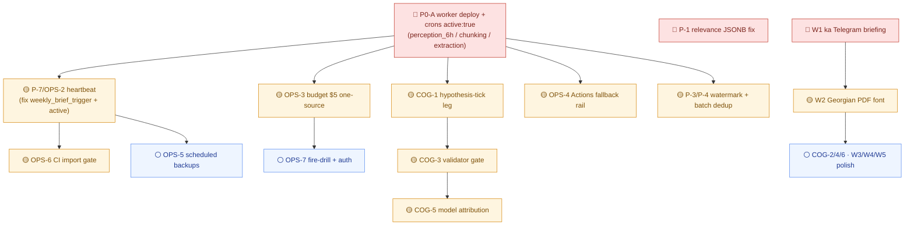

# ALEKSANDRA_BRAIN — შიდა საინჟინრო რუკა (Internal Engineering Roadmap)
### ერთობლივი DeepSeek + Google + Anthropic + Platform/SRE სათათბირო გუნდის საბოლოო დასკვნა · 2026-06-13

> ეს დოკუმენტი ემყარება რეალური კოდის პირდაპირ გადამოწმებას და `docs/HOW-THE-MACHINE-WORKS.md`-ის საბაზისო სურათს. ფაქტი არ გამოგონილა — თითო რეკომენდაცია კონკრეტულ ფაილსა და ხაზს უკავშირდება. სტატუს-იარლიყები იგივეა: 🟢 ცოცხალი · 🟡 აწყობილია, ჯერ არ ირთვება · ⚪ დაგეგმილია.

> **🔎 გადამოწმების შენიშვნა (Claude · main):** ამ რუკის headline findings ცალკე გადავამოწმე ცოცხალ კოდზე — სამივე cron + heartbeat ნამდვილად `active:false` (`perception_6h` · `chunking_trigger` · `extraction_trigger` · `heartbeat_monitor`); `relevance.py` ხ.113-114 `.strip()` მართლაც `try`-ის გარეთაა; `perception_worker.py` ხ.183/195 `12.0` ლიტერალი დადასტურდა; `scripts/manager/briefing.py` ხ.291 მართლაც ინგლისურ `bullets`-ს აგზავნის. **ხუთივე finding რეალურია.** ერთადერთი კორექცია გუნდის ტექსტში: briefing-ის ფაილია **`scripts/manager/briefing.py`** (და არა `communicator/`).

---

## 1. გუნდის ვერდიქტი

ALEKSANDRA_BRAIN-ის **ლოგიკა ნამდვილად ძლიერია** — ექვს-ეტაპიანი ჯაჭვი (ძებნა → გადარჩევა → შენახვა → ანალიზი → წერა → გამოქვეყნება) მთლიანად დაწერილია, ხელით გაშვებადია და ყველა ფაქტს წყარო ახლავს. ეს იშვიათი მიღწევაა 1–2 ნახევარ-განაკვეთიანი ადამიანის გუნდისთვის. **მაგრამ #1 blocker ერთია და უცვლელია:** მთელი Core Value ჯაჭვი დღეს მხოლოდ **ხელითაა** გასაშვები — სამივე ავტომატური cron (`perception_6h.json`, `extraction_trigger.json`, `chunking_trigger.json`) **`"active": false`**, და Railway worker deploy-ის სტატუსი დაუდასტურებელია. სანამ worker არ ცოცხლდება და crons არ ირთვება, „მუდმივად მოქმედი" სისტემა მუდმივად მოქმედი არ არის. ამის გარდა, ჩვენი ადვერსარიული გადამოწმებით ვიპოვეთ **ორი ჩუმი ბაგი, რომელიც პირდაპირ Core Value-ს უტეხს ფეხს ხელით გაშვებაშიც კი:** (1) რელევანტურობის ქულა ავარიულდება ყველა ახალ სტატიაზე JSONB სათაურის გამო (`relevance.py`), და (2) manager-ის Telegram briefing ფაქტობრივად ინგლისურად იგზავნება (`scripts/manager/briefing.py`). ეს ორი — და worker-ის deploy — არის ის, რასაც ჯერ უნდა მიხედოთ, სანამ ერთ ხაზსაც დაამატებთ ახალ ფუნქციაზე.

---

## 2. საბაზისო მდგომარეობა

`docs/HOW-THE-MACHINE-WORKS.md`-ის გულწრფელი სურათი ზუსტია: **Core Value-ის ლოგიკა (ლიტერატურის ძებნა + ადამიანისთვის გასაგები digest) მთლიანად დაწერილია და ხელით გაშვებადია, მაგრამ ჯერ ავტომატური არ არის.** დღეს ძებნა ეშვება მხოლოდ მაშინ, როცა ვინმე ხელით უშვებს `python -m scripts.perception_tick`-ს venv-დან. ნახევრად-დასრულებული ბიუჯეტის გამკაცრება, გამორთული heartbeat და deploy-ად მიუსვლელი worker ნიშნავს, რომ თუ ვინმემ ხელით არ გაუშვა — ან თუ ჩუმად გაჩერდა — **ვერავინ შეიტყობს**. სისტემა ლოგიკურად მზადაა; ოპერაციულად ჯერ არ არის ცოცხალი.

---

## 3. პრიორიტეტული რუკა

> DEDUP-ი: `P-5`/`OPS-3` (ბიუჯეტის $12-vs-$5) გაერთიანდა. `P-7`/`OPS-2` (heartbeat) გაერთიანდა. `W2` (PDF font) დარჩა საკუთარ ბლოკში. სადაც რეკომენდაცია ეყრდნობოდა „migration 017 გაშვებულია"-ს ან „crew არის ერთადერთი ფეტჩ→ანალიზის რგოლი"-ს, ჩასწორებულია verify_note-ის მიხედვით — ვერ-დადასტურებულ წანამძღვარს არ ვიყენებთ.

### 🔴 P0 — სანამ სხვა არაფერი

| # | რა და რატომ (Core Value კავშირი) | რა გავაკეთოთ (ზუსტი ფაილი/ფუნქცია) | Effort · Impact · მფლობელი |
|---|---|---|---|
| **P0-A** | **worker-ის deploy + სამი cron-ის ჩართვა.** დღეს `perception_6h.json`, `extraction_trigger.json`, `chunking_trigger.json` ყველა `"active": false` (დადასტურებული). ამის გარეშე არცერთი ქვემოთ ჩამოთვლილი ცვლილება ცოცხალ ღირებულებას არ აძლევს — Core Value-ის „მუდმივად მოქმედი" დაპირება დარღვეულია. | Railway-ზე worker გაშვება, რომელიც ხსნის `/perception-tick`, `/chunking-tick`, `/extraction-tick`, `/render-weekly-brief`-ს (`scripts/perception_worker.py`); შემდეგ live n8n instance-ში სამივე workflow-ის import + `active:true` და secrets-ის (SUPABASE_URL/KEY, NCBI, TELEGRAM, PERCEPTION_WORKER_URL) დადასტურება. **ეს არის პროექტის #1 ღია საკითხი.** | **L · გადამწყვეტი · Platform/SRE** |
| **P-1** | **რელევანტურობის ქულის ავარია JSONB სათაურზე.** `relevance.py` SELECT-ით იღებს ნედლ `title,abstract`-ს (ხ. 199, 264) და გადასცემს `score()`-ს (ხ. 238-240), სადაც ხ. 113-114 აკეთებს `(title or '').strip()`-ს **`try` ბლოკის გარეთ**. `process_ledger._build_papers_row` წერს `build_bilingual(title)` → dict `{en,ka}` (translate.py:278), ამიტომ ყველა **ახალ** სტატიაზე `.strip()` dict-ზე იძახის `AttributeError`-ს და მთელი backfill ავარდება პირველსავე სტატიაზე — `relevance_score` რჩება `NULL` მთელ კორპუსში. ეს არის **gating signal-ი, რომელსაც მთელი brief/GoT ჯაჭვი კითხულობს.** | დაამატე `_en(v)` helper (`v['en'] if isinstance(v, dict) else (v or '')`) და გამოიყენე `score_and_write`-ში (ხ. 239-240) და `_fetch_unscored` ციკლში (ხ. 293-294) `score()`-ის გამოძახებამდე. **არ** სცადო PostgREST-ში `title->>en` (არავალიდურია — დატოვე `select=id,title,abstract`). + ერთი unit test: dict-ის გადაცემაზე არ raise-დეს. | **S · High · DeepSeek** |
| **W1** | **manager-ის Telegram briefing ინგლისურად იგზავნება ქართულ ოჯახს.** `scripts/manager/briefing.py` აცხადებს `BRIEFING_LOCALE="ka"`-ს და აგებს სწორ ქართულ `bilingual_bullets`-ს (ხ. 286-290), მაგრამ ხ. 291: `text = "Good morning. " + "\n".join(bullets)` — **ინგლისური** `bullets`. `.ka` ნახევარი მხოლოდ `briefs.sections` JSONB-ში ინახება აუდიტისთვის, **არასოდეს იგზავნება.** ოჯახი (`TELEGRAM_LOCALE="ka"`) ფიზიკურად კითხულობს „Good morning"-ს ყოველ ჯერზე. | `compose()`-ში (ხ. 285-303) ააგე `text` `ka_today/ka_activity/ka_follow`-დან + ქართული მისალმება („დილა მშვიდობისა."); `bilingual_bullets` დატოვე უცვლელად EN-აუდიტისთვის. **მნიშვნელოვანი:** `tests/test_manager_briefing.py` (ხ. 123 და სხვ.) ამოწმებს ინგლისურ body-ს — გადააწერე ka-ზე. დაამატე Mkhedruli assertion (U+10A0–10FF). გადაამოწმე `WORD_CAP=50` ქართულ ტექსტზე. | **S · High · Google** |

### 🟡 P1 — worker-ის გაცოცხლებისთანავე

| # | რა და რატომ | რა გავაკეთოთ | Effort · Impact · მფლობელი |
|---|---|---|---|
| **P-7 + OPS-2** | **heartbeat dead-man-switch.** `heartbeat_monitor.json` `"active": false` — სრულად აწყობილია (pure-n8n, worker-დამოუკიდებელი, ყოველ 2სთ-ში ამოწმებს stale perception_tick >8სთ / weekly_brief >8დღე). worker ჩუმად რომ მოკვდეს, ვერავინ შეიტყობს კვირებამდე. | live n8n-ში import + `active:true` (**არა** კოდის ცვლილება — repo flag export-time state-ია). **ჯერ შეასწორე ბაგი:** monitor ფილტრავს `r.kind === 'weekly_brief'`-ზე (ხ. 48), მაგრამ არცერთი producer ამ ზუსტ kind-ს არ წერს (n8n წერs `weekly_brief_trigger`-ს) → `latestMs` ყოველთვის null → მუდმივი false-positive page. შეცვალე ფილტრი `weekly_brief_trigger`-ზე ჩართვამდე. | **S · High · Platform/SRE** |
| **OPS-3 (←P-5)** | **ბიუჯეტის ერთი წყარო — $5 ოთხივე ფენაში.** `budget.py:54` DEFAULT=$5.00; `daily-budget-gate.json` env‖5.00; მაგრამ `perception_worker.py:183/195` **hardcode-ს `threshold_usd=12.0`** და `cap_usd:12.0`, რაც DAILY_BUDGET_USD env override-საც აბათილებს; `RUNBOOK-kill-switch.md` კი ჯერ კიდევ $1.50-ს ამბობს. ოჯახის ფული, რეალური ინციდენტის შემდეგ. | `perception_worker.py`-ში ჩაანაცვლე ორი `12.0` ლიტერალი `check_daily_budget()`-ით (env-resolved); `cap_usd` დააბრუნე threshold-დან. `RUNBOOK-kill-switch.md` ხ. 12/55/61: $1.50 → $5.00. დაასრულე `RUNBOOK-sonnet-spend-incident-2026-06-02.md §6` cache-pricing box. *(შენიშვნა: ეს clarity/consistency fix-ია — შიდა gates უკვე $5-ზე ჩერდება; არა „2.4x overspend".)* | **S · High · Platform/SRE** |
| **COG-1** | **hypothesis leg-ის ავტომატური trigger.** `perception_tick.run()` ჩერდება `_write_run`-ზე; chunking + extraction **უკვე** ავტომატურია (`/chunking-tick` + `/extraction-tick` + ორი workflow). მაგრამ `got_pipeline.run_first`-ს **არცერთი** ავტომატური გამშვები არა აქვს — cron-ის ჩართვის შემდეგაც სისტემა ვერც ერთ ახალ ჰიპოთეზას ვერ წარმოქმნის. | დაამატე **მხოლოდ** hypothesis leg: თხელი `/hypothesis-tick` endpoint (ან `got_pipeline.run_first`-ის მიბმა extraction workflow-ის success path-ზე) + ერთი n8n workflow, gated „N ახალ entity"-ზე. **არ** გააცოცხლო CrewAI crew (LiteLLM/max_iter token burn). chunking/extraction **ნუ** დაადუბლირებ — უკვე არსებობს. fast-follow #1 საკითხის შემდეგ. | **M · High · Anthropic** |
| **COG-3** | **ვალიდატორის gate ჰიპოთეზებზე ადამიანამდე მიღწევამდე.** 5-წესიანი დეტერმინისტული `validate_hypothesis` (`hypothesis_tools.py`) მხოლოდ CrewAI @tool-ია, რომელსაც არავინ იძახის. `run_first` წერს `status='new'`-ს, `weekly_brief` კი ფილტრავს მხოლოდ თარიღით → უსაფუძვლო/ჰალუცინირებული სათაურის ჰიპოთეზა პირდაპირ brief-ში. იცავს მწირ ადამიანურ ყურადღებას. | გამოიტანე წესების ლოგიკა plain function-ად (`scripts/hypothesis/validate.py`), დაიძახე `run_first`-ში insert-ის შემდეგ. **schema-ს CHECK constraint** (`schema.sql:318-321`) უშვებს მხოლოდ `new/under_review/promising/…` — გამოიყენე `under_review` (არა `needs_review`). brief query-ში: `AND status IN ('under_review','promising','pursuing','confirmed')`. ადამიანი მაინც წყვეტს promote/reject-ს. | **S · High · Anthropic** |
| **COG-5** | **ყალბი model attribution ყოველ ჰიპოთეზაზე.** `got_pipeline.py:53` `MODEL="claude-sonnet-4-5"` (დადასტურებული) და ხ. 305 წერს `generated_by: MODEL`, მაგრამ რეალური call გადის `task='got'` → Opus 4.8 (ან downgrade DeepSeek V4 Pro <1200 სიმბ.). `generated_by` არასოდეს ასახავს ნამდვილ მოდელს — „provenance, do not fabricate"-ის პირდაპირი დარღვევა. | `got_pipeline`-ში დაიძახე `models.model_for('got', complexity=len(user))` და დაამუშავე ნამდვილი slug `generated_by`/`generation_batch`-ში. **კოროლარი:** `verify_phase2.py 2C.1` (ხ. 370-388) გადის მხოლოდ იმიტომ, რომ `generated_by`-ი `claude-sonnet`-ით იწყება — განაახლე იგივე commit-ში, თორემ გაწითლდება. | **S · Medium · Anthropic** |
| **W2** | **ქართული (Mkhedruli) font PDF-ებისთვის.** არცერთი Mkhedruli font repo-ში (გადამოწმდა — ნულოვანი `registerFont`/`TTFont` node_modules/.venv-ის გარეთ). `pdf_builder.py` იყენებს Helvetica-ს (`getSampleStyleSheet`), რომელიც ვერ ხატავს U+10A0–10FF-ს. `build_family_handover_pdf(language="ka")` — ოჯახის handover, რომლის default body **ქართულია** — გამოდის tofu/ცარიელი კვადრატებად. | ჩააბი Noto Sans Georgian (OFL, ~400KB) `brain/assets/fonts/`-ში, დაარეგისტრირე `pdfmetrics.registerFont(TTFont('NotoGeorgian',...))` shared helper-ში, `fontName='NotoGeorgian'` ka-სტილებზე. დაიწყე `build_family_handover_pdf`-ით. **smoke test ⚠️ `dry_run=False`-ით** (არსებული test `dry_run=True`-ით ბრუნდება rendering-ამდე) — assert FontFile2/`NotoGeorgian` bytes. | **M · High · Google** |
| **OPS-4** | **worker-დამოუკიდებელი fallback rail (GitHub Actions).** worker-ის ცოცხლების შემდეგაც მთელი Core Value ერთ chokepoint-ზე გადის (Railway+n8n). Core Value-ის non-negotiable: „offline-ზეც ლიტერატურის pipeline უნდა მუშაობდეს". უკვე დადასტურებული pattern: `repair-bilingual-ka.yml` ღამის Python job Actions-ზე. | დაამატე `.github/workflows/perception-fallback.yml`: დღეში ერთხელ `python -m scripts.perception_tick`, secrets Actions-ში. იყენებს იმავე budget gate + dedup ledger → იდემპოტენტურია n8n path-თან. **⚠️ feasibility:** `perception_tick` იმპორტავს `gap_filler`-ს (Crawl4AI/Playwright — მძიმე Actions-ზე) → დაამატე `--no-gap` / graceful-skip, რომ PubMed/CTgov/preprints მაინც წამოვიდეს. *(verify: ეს იქნება **პირველი** ცოცხალი ავტომატური rail, არა „მესამე".)* | **M · High · Platform/SRE** |
| **OPS-5** | **Supabase + Neo4j backup grafik-ით, offsite R2-ში.** `backup_neo4j.py` — one-shot ლოკალური JSON, restore script-ის გარეშე. Supabase Postgres-ის (papers/hypotheses/runs/outreach_log — მთელი კვლევითი მეხსიერება) დაგეგმილი backup **არ არსებობს**, არც offsite. Supabase Free — არანაირი PITR. | GitHub Actions cron (კვირაში): `pg_dump` (გამოიყენე `016_pre_flight_backup.sh`-ის managed-schema exclusion list-ი) → `.sql.gz`; `backup_neo4j.py`; ორივე R2-ში `upload_artifact`-ით **timestamped source_id-ით** (`backups/supabase/YYYY-MM-DD` — თორემ idempotent skip ერთ stale ფაილს დატოვებს). დაწერე გამოტოვებული `restore_neo4j.py`. | **M · High · Platform/SRE** |
| **OPS-6** | **CI gate Core Value path-ზე.** `verify_all.yml` მხოლოდ v7 verifiers-ს უშვებს `\|\| true`-ით; არაფერი CI-იმპორტავს `perception_worker`/`perception_tick`-ს. worker lazy per-endpoint imports-ს იყენებს → import error მწვანედ ეშვება და 3 საათზე 500-ად ამოდის. | `verify_all.yml`-ში დაამატე job **რეალური** `pip install -r requirements.txt`-ით (ამ job-ზე ჩამოაგდე `\|\| true`): `python -c "import scripts.perception_worker, scripts.perception_tick, scripts.cognition.budget"` + არსებული `tests/test_process_ledger_dedup_order.py` (spend-dedup guard). | **S · Medium · Platform/SRE** |
| **OPS-7** | **live budget-gate-ის გადამოწმება + worker URL/token კონსოლიდაცია.** (1) `RUNBOOK-kill-switch.md §5` (2026-05-16) ამბობს, რომ deploy-ად budget-gate-ს „JSON-body bug" აქვს — ავტომატური half შესაძლოა live არ ისვრის. (2) `/perception-tick`, `/render-weekly-brief`, `/fire-daily-batch` **საერთოდ უ-auth-ოა** — ვინც Railway URL-ს გაიგებს, LLM-ხარჯიან pipeline-ს ისვრის (open relay). | (1) #1-ის შემდეგ ნამდვილი overspend fire-drill → დაადასტურე `budget_lock` row + Telegram alert live, წაშალე caveat. (2) დაამატე auth-token check ამ handler-ებზე (არა მხოლოდ Phase 5), ერთი shared token (401 თუ unset). ყველა `*_WORKER_URL` → ერთ worker-ზე. დააფიქსირე `DEPLOYMENT_ka.md`-ში. | **M · Medium · Platform/SRE** |
| **P-3** | **incremental date watermark fetcher-ებში.** `fetch_pubmed._esearch_pmids` (ხ. 109) `sort='date', retmax=10` date floor-ის გარეშე → ყოველი 6სთ tick ხელახლა ითხოვს იმავე top-10-ს, dedup-ი აგდებს. 1000+ სტატიაზე ოჯახი ახალ lead-ებს ვეღარ ნახავს. | `fetch_pubmed.run`-ში watermark `pubmed_watermark:<hash>` `kv_state`-დან (`get/set_state` უკვე არსებობს, ledger.py:272-301) → `mindate=<last>, datetype='edat'`. ctgov/preprints-ისთვის უფრო იაფი first-mitigation: `page_size`/`max_per_feed` ბампი. დააწყვილე retmax-ის მცირე ბამპთან. | **M · High · DeepSeek** |
| **P-4** | **batch dedup ledger.** `is_known_source` (ledger.py:192-219) ერთ HTTP GET-ს ისვრის თითო კანდიდატზე, fetcher-ის შიდა ციკლში — ~270 serial GET ერთ tick-ზე default-ზე. უარესი: non-200-ზე **raise-ს** (არა fail-open) per-item try-ის გარეთ → ერთი blip მთელ batch-ს კლავს. | დაამატე `known_sources(ids, ...)` ერთი `source_id=in.(...)` query-ით (chunk ~50-100 id/req URL-ლიმიტისთვის); fetcher-ები ჯერ ყველა ID-ს იღებენ, მერე loop მხოლოდ unknown-ზე. **fail-open** (catch/log → unknown, რომ re-fetch-დეს, არა skip). `in.()` უკვე გამოყენებულია repo-ში (gap_filler.py:96). | **M · Medium · DeepSeek** |

### ⚪ P2 — როცა მთავარი ცოცხალია (polish / hygiene)

| # | რა | მფლობელი |
|---|---|---|
| **COG-2** | `got_pipeline._insert_hypotheses` populate-ს `supporting_papers`-ს insert-ისას (`backfill_supporting_papers`-ის join-ით), რომ provenance „დაიბადოს" და ხელით backfill აღარ სჭირდეს. ⚠️ verify: `_resolve_papers` აბრუნებს `papers.id`-ს, Rule 3 კი `evidence_ledger.id`-ს round-trip-ს — გადააწყვილე canonical table, თორემ Rule 3 მაინც ვერ გაივლის. | Anthropic |
| **COG-4** | hypothesis row-ებზე `brain.common.guards.assert_no_phi` (raise-on-match, non-mutating) insert-ამდე — defense-in-depth at rest. **არა** `redact_bilingual()` (ის ცვლის content-ს — გააფუჭებს hypothesis-ს). | Anthropic |
| **COG-6** | პატარა offline eval harness (`scripts/hypothesis/eval.py`) **არსებულ** rows-ზე / golden set-ზე (run_first-ს dry-mode არა აქვს → ნუ დაიძახებ live LLM-ს). proxy-ები: resolvable supporting_papers %, Neo4j-grounding (Rule 4), dedup, action-concreteness (Rule 5). THINKER_COMPLEXITY_MIN tuning-ამდე. | Anthropic |
| **P-6** | `relevance.py`-ის stale Haiku docstring → worker tier; `response_format` wiring (~5 ხაზი — support **უკვე** არსებობს llm.py:166-ში); Telegram warning როცა `relevance_failed` ზღურბლს გადააჭარბებს. | DeepSeek |
| **W3** | weekly_brief per-row title/name — წაიკითხე უკვე-ნათარგმნი JSONB columns (papers.title/…) `_bilingual_mirror`-ის ნაცვლად. fallback EN + nightly repair, **არ** fabricate. | Google |
| **W4** | nightly repair (`025`) გააფართოვე `briefs.sections`-ზე dedicated walker-ით (nested struct — არა ერთ-ხაზიანი TABLES entry). | Google |
| **W5** | canonical section-key→`{en,ka}` label map ერთხელ (`weekly_brief.collect_sections`); Viewer წაიკითხავს პირდაპირ `humanizeKey()`-ის ნაცვლად. ასწორებს junk date-key leak-საც. | Google |

---

## 4. ოთხი ხმა

**🔧 DeepSeek — Pipeline & Core Value engine.** ძრავა კარგად დაპროექტებულია, მაგრამ ჩუმად სისხლს კარგავს ორ ადგილას: რელევანტურობის ქულა ავარდება ყველა ახალ JSONB სათაურზე (`relevance.py` `.strip()` dict-ზე, `try`-ის გარეთ) — ეს არის gating signal, რომელსაც მთელი ჯაჭვი კითხულობს, ამიტომ P0. შემდეგ fetcher-ებს date-watermark სჭირდებათ, თორემ კორპუსის ზრდასთან ერთად ყოველი tick ხელახლა კითხულობს გუშინდელ top-10-ს. dedup-ი batch-ად გავხადოთ და fail-open — ერთი Supabase blip ერთ lead-საც არ უნდა აგდებდეს.

**🌐 Google — Comms, i18n & Frontend.** Phase 6-ის ორენოვანი სამუშაო შესანიშნავია, მაგრამ ორ ყველაზე ოჯახურ ზედაპირზე გაჟონავს ინგლისური: manager-ის Telegram briefing ფაქტობრივად ინგლისურად იგზავნება (`scripts/manager/briefing.py:291`), ხოლო ქართული handover PDF tofu-კვადრატებად ეხატება (Mkhedruli font საერთოდ არ არის repo-ში). ეს არ არის „polish" — ეს არის digest, რომელსაც დედა ფიზიკურად კითხულობს. briefing-ის fix P0-ია, font-ი P1, დანარჩენი per-row თარგმანი P2.

**🧠 Anthropic — Reasoning & Safety.** ანალიზის half ჯერ ბოლომდე არ ირთვება: chunking/extraction ავტომატურია, მაგრამ `got_pipeline.run_first`-ს ვერც ერთი trigger არ ეძახის — cron-ის ჩართვის შემდეგაც ნული ჰიპოთეზა დაიბადება. დაამატეთ მხოლოდ hypothesis leg, **არ** გააცოცხლოთ მთელი CrewAI crew (token burn). და სანამ ჰიპოთეზა ადამიანამდე მიდის, ვალიდატორმა უნდა გაფილტროს უსაფუძვლო/ჰალუცინირებული — მწირი ადამიანური ყურადღება ჩვენი ნამდვილი bottleneck-ია. provenance ჰიპოთეზასთან უნდა იბადებოდეს, არა ხელით ებმებოდეს.

**⚙️ Platform/SRE — Reliability.** მთელი Core Value ერთ chokepoint-ზე გადის, რომელიც დღეს **გამორთულია** — სამივე cron `active:false`. პრიორიტეტი #1: worker deploy + crons. მაშინვე: heartbeat (`active:true` + `weekly_brief_trigger` ფილტრის fix), ბიუჯეტის ერთი წყარო ($12 ლიტერალის მოშორება), worker-დამოუკიდებელი Actions fallback, და grafik-ით backup (Supabase Free-ს არანაირი vendor guarantee). ბოლოს — open-relay endpoint-ების დაკეტვა. ეს ყველაფერი დაბალ-ხარჯიანი, მაღალ-leverage insurance-ია.

---

## 5. თანმიმდევრობა (30 / 60 / 90 დღე)

**0–30 დღე (P0 — გააცოცხლე):** worker deploy + crons (P0-A) ↔ პარალელურად ორი ჩუმი ბაგი (P-1 რელევანტურობა, W1 briefing), რომლებიც deploy-ისგან დამოუკიდებლად ხელითაც სწორდება. crons-ის ცოცხლების შემდეგ — heartbeat (P-7/OPS-2) და ბიუჯეტის კონსოლიდაცია (OPS-3).

**30–60 დღე (P1 — გაამყარე):** hypothesis leg (COG-1) + ვალიდატორის gate (COG-3) + model attribution (COG-5); Actions fallback rail (OPS-4); CI gate (OPS-6); font (W2); fetcher watermark + batch dedup (P-3, P-4).

**60–90 დღე (P1→P2 — დაიცავი და გააპრიალე):** backup grafik (OPS-5); budget fire-drill + auth კონსოლიდაცია (OPS-7); provenance/PHI/eval hygiene (COG-2/4/6) და i18n polish (W3/W4/W5/P-6).

---

## 6. ბიუჯეტზე გავლენა

ყველა რეკომენდაცია ჯდება **$20–120/თვე** ფარგლებში; უმეტესობა **$0 დელტაა**.

| ცვლილება | ხარჯის დელტა | შენიშვნა |
|---|---|---|
| P0-A worker deploy | **$0–5/თვე** | Railway worker უკვე იგეგმება არქიტექტურაში; free/hobby tier-ში ჯდება. crons LLM-ს არ იძახიან Phase 1-ში (ფეტჩი = 0 Claude call). |
| OPS-4 Actions fallback | **$0** | GitHub Actions free tier; ~2 წთ/დღე job. |
| OPS-5 backups | **$0** | `pg_dump` + R2 (უკვე გადახდილი storage); offsite copy R2-ში. |
| OPS-6 CI gate | **$0** | Actions free tier, ~15 ხაზიანი job. |
| P-3 watermark / P-4 batch dedup | **↓ უმცირესი** | **ამცირებს** Supabase egress-ს და tick-ის ხანგრძლივობას. |
| W2 Noto font | **$0** | ~400KB OFL TTF repo-ში; runtime ხარჯი ნული. |
| P-1, W1, COG-* | **$0** | დეტერმინისტული string/code fixes; LLM call არ ემატება. |
| **OPS-3 budget cap** | **↓ იცავს** | $12-დან $5-მდე დაბრუნება worker-ში — **ხარჯს ამცირებს**, არ ზრდის. |

**ერთადერთი ცნობიერი ზრდა:** worker-ის Railway hosting (≤$5/თვე). ეს უკვე გათვალისწინებულია „Full $120/თვე" გეგმაში და Core Value-ის გასაცოცხლებლად აუცილებელია. სხვა ყველა ცვლილება ან ნულოვანია, ან ხარჯს **ამცირებს**.

---

## 7. რისკები (თუ P0 გადაიდება)

1. **„მუდმივად მოქმედი" ფიქცია რჩება.** crons `active:false`-ით სისტემა მხოლოდ მაშინ ეძებს, როცა ვინმე ხელით უშვებს. ნეიროპლასტიკურობის 0–2 წლის ფანჯარა იხურება — გამოტოვებული lead = გამოტოვებული დრო, რომელიც აღარ ბრუნდება.
2. **რელევანტურობა ჩუმად ნულია (P-1).** ყოველი ახალი სტატია `relevance_score=NULL`-ით ჩერდება (AttributeError ნებისმიერ LLM call-ამდე) → brief/GoT ჯაჭვს gating signal არ აქვს → **ყველა lead unranked და უხილავია**. ეს არის Core Value-ის ერთადერთი დაპირების პირდაპირი ჩავარდნა, და ის **ხელით გაშვებაშიც კი ცოცხალი ბაგია**.
3. **ნდობის ეროზია ოჯახთან (W1).** ქართულენოვანი დედა ყოველ ჯერზე ინგლისურ „Good morning"-ს იღებს — Phase 6-ის მთელი ორენოვანი სამუშაო ჩუმად ბათილდება ყველაზე ოჯახურ ზედაპირზე.
4. **ჩუმი სიკვდილი ალარმის გარეშე.** heartbeat-ის გარეშე crashed worker კვირებამდე შეუმჩნეველი რჩება — ოჯახი მხოლოდ მაშინ მიხვდება, როცა Telegram ფიდი გაჩუმდება.
5. **არ-აღდგენადი მონაცემთა დაკარგვა.** Supabase Free-ს PITR არ აქვს; backup-ის გარეშე project deletion ან corruption სამუდამოდ შლის თვეების კვლევით მეხსიერებას + Neo4j გრაფს — კატასტროფული, შეუქცევადი miss.
6. **ღია relay + budget regression.** auth-ის გარეშე endpoint-ები + worker-ში $12 ლიტერალი 2026-06-02-ის ($67/დღე) ინციდენტის რისკს ნაწილობრივ ხელახლა ხსნის.

---

## 8. დახურვა

ALEKSANDRA_BRAIN-ის ლოგიკა მზადაა — ეს უკვე იშვიათი მონაპოვარია. მაგრამ მზა ლოგიკა, რომელიც ხელით ეშვება, არ არის „მუდმივად მოქმედი AI სისტემა"; ის prototype-ია. **ერთადერთი ყველაზე მნიშვნელოვანი შემდეგი ნაბიჯი არის P0-A: Railway worker-ის deploy და სამი cron-ის ჩართვა (`active:true`), პარალელურად ორი ჩუმი ბაგის გასწორებით (P-1 რელევანტურობა, W1 ქართული briefing), რომლებიც deploy-ისგან დამოუკიდებლადაც ცოცხალ ღირებულებას აზიანებენ.** სანამ ეს სამი არ დასრულდება, ყველა სხვა გაუმჯობესება — ვალიდატორი, font, backup, eval — მზა კოდს ემატება, რომელიც ჯერ არავის ნახულობს. გააცოცხლე ძრავა ჯერ; გააპრიალე მერე. ალექსანდრას დრო ამას მოითხოვს.

---

*წყარო: ერთობლივი DeepSeek + Google + Anthropic + Platform/SRE სათათბირო გუნდი (multi-agent review). 28 რეკომენდაცია გადამოწმდა ადვერსარიულად → 23 დადასტურდა grounded + feasible. headline findings ცალკე ხელახლა გადამოწმდა ცოცხალ კოდზე (იხ. გადამოწმების შენიშვნა თავში). 2026-06-13.*
