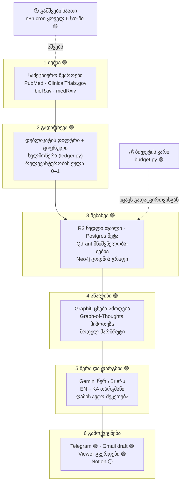

# როგორ მუშაობს მანქანა — ALEKSANDRA_BRAIN ახსნილი

> ეს დოკუმენტი ხსნის, **როგორ მუშაობს მთელი სისტემა**, ისე, რომ პროგრამისტობა საჭირო არ იყოს.
> წარმოიდგინე, რომ ეს ერთი დიდი მანქანაა — ქარხანა, რომელიც ღამე-დღე ეძებს ალექსანდრასთვის
> სამკურნალო შესაძლებლობებს. ქვემოთ ვათვალიერებთ ამ მანქანის თითოეულ ნაწილს.
>
> ინსტრუმენტების სახელები (PubMed, Neo4j, Gemini…) დარჩა ინგლისურად, რადგან ეს მათი
> ნამდვილი სახელებია — მაგრამ თითო მათგანი აქვე აიხსნება მარტივად.

---

## 🚦 როგორ წავიკითხო იარლიყები

მანქანის ზოგი ნაწილი უკვე მუშაობს, ზოგი აწყობილია მაგრამ ჯერ ჩართული არ არის, ზოგი კი
ჯერ მხოლოდ ნახაზზეა. ამას არ ვმალავთ — თითო ნაწილს მიწერია სტატუსი:

| იარლიყი | მნიშვნელობა |
|--------|-------------|
| 🟢 **ცოცხალი** | კოდი არსებობს და მუშაობს (ან ხელით გაშვებაა შესაძლებელი ახლავე) |
| 🟡 **აწყობილია, ჯერ არ ირთვება** | კოდი დაწერილია, მაგრამ ავტომატური გამშვები (cron/worker) ჯერ არ მუშაობს |
| ⚪ **დაგეგმილია** | მხოლოდ გეგმაშია ნახსენები, კოდი ჯერ არ დაწერილა |

ეს გულწრფელობა პროექტის მთავარი წესია: **ფაქტს არ ვიგონებთ.**

---

## 🏭 მთელი მანქანა ერთ სურათად

მანქანას აქვს **ექვსი საამქრო (ეტაპი)**. მონაცემი (ანუ ინფორმაცია სამედიცინო კვლევებზე)
შემოდის მარცხნიდან, გადის თითო საამქროში და მარჯვნივ გამოდის უკვე გასაგებ, ნათარგმნ
შეტყობინებად ოჯახისთვის და ექიმისთვის.



> **დიაგრამის კითხვა:** მთავარი ნაკადი (1→6) უკვე **ცოცხალია** — ე.ი. ხელით გაშვებისას
> მუშაობს. 🟡 ნაწილი ის არის, რომ ეს ჯაჭვი ჯერ **ხელით** ეშვება; ავტომატური საათი
> (n8n cron ყოველ 6 საათში) ჯერ ჩართული არ არის (იხ. თავი 1, ბოლო ნაწილი).

---

## თავი 1 — ძებნა: სად, ვინ და რით ეძებს მანქანა

> **ერთი წინადადებით:** მანქანა ყოველ რამდენიმე საათში ერთხელ ათვალიერებს მსოფლიო
> სამედიცინო ბაზებს (PubMed, ClinicalTrials.gov, preprint-სერვერები), ეძებს ალექსანდრას
> დიაგნოზთან დაკავშირებულ ახალ კვლევებსა და ცდებს, და ყველა ნაპოვნს ცალკე „რეესტრში"
> არეგისტრირებს.

### 1.1 სად ეძებს — ხუთი წყარო

მანქანას ხუთი „კარი" აქვს გარე სამყაროში. თითო კარი თავის ბაზას უყურებს:

| # | წყარო (კარი) | რას ეძებს იქ | ინსტრუმენტი / ფაილი | სტატუსი |
|---|--------------|-------------|---------------------|---------|
| 1 | **PubMed** | გამოქვეყნებული სამეცნიერო სტატიები | `scripts/fetch_pubmed.py` (Biopython `Entrez`) | 🟢 |
| 2 | **ClinicalTrials.gov** | მიმდინარე კლინიკური ცდები (სად იღებენ პაციენტებს) | `scripts/fetch_ctgov.py` (v2 REST API) | 🟢 |
| 3 | **bioRxiv + medRxiv** | „preprint" — ჯერ არარეცენზირებული, ახალი კვლევები | `scripts/fetch_preprints.py` (RSS) | 🟢 |
| 4 | **სრული ტექსტი** | სტატიის სრული შინაარსი (არა მხოლოდ რეზიუმე) | `scripts/gap_filler.py` (Crawl4AI + Firecrawl) | 🟢 |
| 5 | **უარყოფითი მტკიცებულება** | სად **არ** იმუშავა მკურნალობამ (null/გაუქმებული) | `scripts/fetch_negative.py` | 🟢 |

რას ნიშნავს თითო ინსტრუმენტი მარტივად:

- **PubMed** — მსოფლიოს უდიდესი სამედიცინო ბიბლიოთეკის ძებნის სისტემა (აშშ-ის ეროვნული
  ჯანმრთელობის ინსტიტუტი). მანქანა მას ელაპარაკება `Entrez`-ით — ეს არის ოფიციალური
  „კარის ზარი", რომლითაც პროგრამა PubMed-ს კითხვებს უსვამს. სტატია მოაქვს `.xml` ფაილად.
- **ClinicalTrials.gov** — აშშ-ის ოფიციალური რეესტრი მიმდინარე კლინიკური ცდებისა. მნიშვნელოვანია,
  რადგან აქ ჩანს **ცოცხალი შესაძლებლობები** — სად აგროვებენ ახლა პაციენტებს. მანქანა მხოლოდ
  იმ ცდებს იღებს, რომლებიც **აქტიურად ეძებენ მონაწილეებს** (recruiting / not-yet-recruiting),
  რადგან დახურული ცდა ალექსანდრას ვერ დაეხმარება.
- **bioRxiv / medRxiv** — სერვერები, სადაც მეცნიერები ჯერ რეცენზიამდე დებენ ახალ კვლევებს.
  აქ ინფორმაცია **ყველაზე ახალია**. მანქანა მათ ეცნობა „RSS"-ით (ეს ისეთი ციფრული ლენტია,
  რომელიც ახალ პუბლიკაციებს ავტომატურად ანონსებს). უყურებს ორ კონკრეტულ ლენტას:
  bioRxiv-ის ნეირომეცნიერებას და medRxiv-ის პედიატრიას.
- **სრული ტექსტი (Crawl4AI / Firecrawl)** — ხშირად PubMed მხოლოდ **რეზიუმეს** აძლევს, არა
  სრულ სტატიას. ამიტომ მანქანას ჰყავს „მკითხველი", რომელიც გადადის სტატიის ვებგვერდზე და
  სრულ ტექსტს იღებს. ჯერ ცდილობს **Crawl4AI**-ით (უფასო, ძირითადი); თუ ვერ ახერხებს ორჯერ —
  გადადის **Firecrawl**-ზე (ფასიანი, სათადარიგო), ისიც მხოლოდ თუ თვიური ხარჯის ლიმიტი არ
  ამოწურულა. ნაპოვნი ტექსტი ცალკე ფაილად ინახება.
- **უარყოფითი მტკიცებულება** — ჭკვიანი დეტალი. მანქანა შეგნებულად ეძებს **ცუდ ამბავსაც**:
  სად **არ** იმუშავა ან გაუქმდა (retracted) ის მკურნალობები, რომლებსაც ალექსანდრა იღებს ან
  განიხილავს. ამისთვის `therapies` ცხრილიდან იღებს აქტიურ მკურნალობებს და თითოზე სამ ისეთ
  ძებნას აწყობს, როგორიც: `"<წამალი> no effect"`, `"<წამალი> null result"`,
  `"<წამალი> Retracted Publication"`. ეს ხელს უშლის ცრუ იმედს.

> ⚪ **რა არ მუშაობს ამ ეტაპზე:** დოკუმენტებში ნახსენები **RAGFlow**, **Browser Use** (paywall-ის
> გვერდის ავლა) და **Tavily** ჯერ **არ არის** კოდში ჩაშენებული — მხოლოდ გეგმაშია.

### 1.2 ვინ ეძებს — დირიჟორი

ხუთივე კარს ერთი „დირიჟორი" მართავs — `scripts/perception_tick.py` 🟢. ის რიგრიგობით
უშვებს ხუთ პასს (PubMed → ClinicalTrials → preprints → სრული ტექსტი → უარყოფითი) და
ბოლოს ითვლის რამდენი ახალი ჩანაწერი დაემატა. ერთი ცუდი წყარო რომ გაფუჭდეს, დანარჩენებს
არ აჩერებს (თითო პასი იზოლირებულად ეშვება).

გაშვების ბოლოს `perception_tick` **Telegram-ში** აგზავნის მოკლე ანგარიშს, მაგ.:

```
🕷️ perception_tick OK  +42 rows in 120s
  pubmed=10  ctgov=8  preprints=5
  gap-fill=15  negative=4
```

ხედვაში არსებობს აგრეთვე CrewAI-ის „**Spider**" აგენტი (`agents/spider.py` 🟡) — ეს არის
„ჭკვიანი მძებნელი", რომელმაც მომავალში თავად უნდა გადაწყვიტოს **რა** ეძიოს; ჯერ
განსაზღვრულია, მაგრამ მთავარ ჯაჭვში ჩართული არ არის.

### 1.3 რით / რა მეთოდით ეძებს

- **PubMed-ს** — ოფიციალური `Entrez` API-ით (ჯერ ეძებს ID-ებს `esearch`-ით, მერე იღებს
  სრულ ჩანაწერს `efetch`-ით). იცავს NCBI-ის წესს (წამში 10 მოთხოვნა, თუ გასაღები აქვს).
- **ClinicalTrials.gov-ს** — პირდაპირი ვებ-მოთხოვნით (`httpx`) მათ უფასო v2 API-ზე.
- **preprint-ებს** — RSS-ის წამკითხველით (`feedparser`).
- **სრულ ტექსტს** — ბრაუზერივით „crawler"-ით (Crawl4AI), რომელიც გვერდს ნახულობს და
  ტექსტს სუფთა სახით იღებს.

### 1.4 როგორ წყდება, რა სახის ინფორმაცია უნდა მოიძებნოს

ეს ალბათ ყველაზე მნიშვნელოვანი კითხვაა. პასუხი ორნაწილიანია:

1. **ხელით შედგენილი სია (ფიქსირებული):** წინასწარ ჩაწერილია **20 საძიებო ფრაზა**
   `fetch_pubmed.py`-ში — ეს ალექსანდრას „კვლევის რუკაა":
   - **10 პირდაპირი ფრაზა** მისი დიაგნოზის გარშემო — მაგ. „hypoxic ischemic encephalopathy
     treatment", „infantile spasms novel treatment", „cystic encephalomalacia outcome".
   - **10 „cross-disease" (ჯვარედინი) ფრაზა** — ჭკვიანი ხრიკი: ეძებს მკურნალობებს **სხვა**
     დაავადებებიდან, რომლებსაც **მსგავსი მექანიზმი** აქვთ. მაგ. „erythropoietin
     neuroprotection neonatal", „melatonin hypoxia neuroprotection", „exosome therapy
     brain injury". იდეა: შესაძლოა სხვა სფეროში უკვე არსებობდეს რამე, რაც ალექსანდრასაც
     გამოადგება.
   - ClinicalTrials.gov-ს თავისი **5 ფიქსირებული** ფრაზა აქვს (HIE, infantile spasms,
     cerebral palsy + ღეროვანი უჯრედები, neonatal encephalopathy, vigabatrin).
2. **ცოცხალი სია (დინამიური):** „უარყოფითი" კარი ფრაზებს **თავად ქმნის** ალექსანდრას
   რეალური მკურნალობების მიხედვით — `therapies` ცხრილიდან იღებს, რას იღებს ან განიხილავს
   ის ახლა, და სწორედ მათზე ეძებს საწინააღმდეგო მტკიცებულებას.

ანუ მანქანა **არ** ეძებს „ყველაფერს ბრმად" — მას აქვს ფოკუსირებული რუკა (ფიქსირებული)
პლუს ალექსანდრას ცოცხალ მდგომარეობაზე მორგებული ნაწილი (დინამიური).

### 1.5 რა პერიოდულობით ეძებს

განზრახული რიტმია **ყოველ 6 საათში ერთხელ**. ამას უნდა აშვებდეს ავტომატური საათი —
n8n-ის workflow `workflows/perception_6h.json`.

> 🟡 **გულწრფელად:** ეს საათი ჯერ **გამორთულია** (`"active": false`). ფაილში პირდაპირ
> წერია, რომ ის ჩაირთვება მხოლოდ მას შემდეგ, რაც Railway-ზე ე.წ. „worker" გაეშვება,
> რომელიც `/perception-tick` მისამართს გახსnis. ამ წუთას ძებნა **ხელით** ეშვება ბრძანებით
> `python -m scripts.perception_tick`. ე.ი. **ლოგიკა მზადაა, ავტომატური რიტმი — ჯერ არა.**
> (ეს არის პროექტის #1 ღია საკითხი.)

### 1.6 დაცვის ორი მცველი

ძებნა „ბრმად" არ ხდება — ორი მცველი იცავს:

- **დუბლიკატის მცველი:** ყოველ ჩამოტვირთვამდე მანქანა ამოწმებს „უკვე გვაქვს თუ არა ეს?"
  (`is_known_source`). ეს ხარჯსაც ზოგავს და გრაფს არ ანაგვიანებს. (დეტალურად → თავი 2.)
- **ბიუჯეტის მცველი:** ყოველი გაშვების დასაწყისში ამოწმებს, ხომ არ ამოიწურა დღიური ბიუჯეტი;
  თუ ამოიწურა, საერთოდ არ ეძებს და Telegram-ში წერს „🛑 budget gate locked". (დეტალურად → თავი 3.)

---

## თავი 2 — გადარჩევა: რელევანტურობა და დუბლიკატები

> **ერთი წინადადებით:** სანამ რამეს დაამუშავებს, მანქანა ორ კითხვას სვამს —
> „ეს უკვე ხომ არ გვაქვს?" და „რამდენად ეხება ეს ალექსანდრას?". მხოლოდ ახალი და
> რელევანტური ინფორმაცია მიდის შემდეგ ეტაპზე.

### 2.1 ჯერ — დუბლიკატის ფილტრი

ყოველი წყაროდან რომ მოაქვს ჩანაწერი, მანქანა ჯერ ამოწმებს „**უკვე გვაქვს?**" —
ფუნქცია `is_known_source()` (`scripts/ledger.py` 🟢). თუ უკვე გვაქვს, საერთოდ არ ჩამოტვირთავს.
ეს ერთდროულად ხარჯსაც ზოგავს და ბაზასაც სუფთად ინახავს.

გარდა ამისა, ყველა ჩამოტვირთულ ფაილს ერთვის **ციფრული ხელმოწერა** — `compute_hash()`
აკეთებს SHA256-ს (გრძელი უნიკალური კოდი, ფაილის „თითის ანაბეჭდი"). თუ ერთი და იგივე
სტატია ორი სხვადასხვა წყაროდან მოვიდა, ხელმოწერა ერთნაირი იქნება და მანქანა ცნობს, რომ ეს
ერთი და იგივეა.

### 2.2 მერე — რელევანტურობის ქულა

დარჩენილ ახალ სტატიებს ანიჭებს ქულას **0-დან 1-მდე** — ფაილი `scripts/scoring/relevance.py` 🟢.
ამას აკეთებს იაფი „worker" მოდელი (DeepSeek), რომელსაც აძლევენ სტატიის სათაურსა და რეზიუმეს,
და ალექსანდრას ზუსტ კონტექსტს (მძიმე HIE, cystic encephalomalacia, შენარჩუნებული ღერო,
ნეიროპლასტიკურობის ფანჯარა 0–2 წელი). რუბრიკა მარტივ ენაზე:

| ქულა | რას ნიშნავს |
|------|-------------|
| **0.90–1.00** | პირდაპირ HIE-ის მკურნალობა ან მექანიზმი, ჩვილებზე მონაცემებით |
| **0.70–0.89** | HIE-ს ეხება, მაგრამ მოზრდილებზე/ცხოველებზე, ან მონათესავე მდგომარეობა |
| **0.50–0.69** | სხვა დაავადება (ტრავმა, ინსულტი), მაგრამ მექანიზმი შესაძლოა გადმოვიდეს |
| **0.30–0.49** | მხოლოდ ირიბად კავშირშია |
| **0.00–0.29** | სხვა თემაა, არ გვჭირდება |

ქულასთან ერთად ანიშნებს ორ დროშას: **`direct_relevance`** (პირდაპირ HIE-ზეა?) და
**`cross_disease_relevance`** (სხვა დაავადებიდან გადმოსატანი იდეაა?) — და თუ ჯვარედინია,
წერს საიდან (`cross_disease_source`, მაგ. „TBI", „perinatal stroke"). ეს ყველაფერი ინახება
`papers` ცხრილში.

### 2.3 გულწრფელი დეტალი — როცა შეფასება ვერ ხერხდება

თუ მოდელმა რაიმე მიზეზით ვერ შეაფასა სტატია, მანქანა **არ აგდებს** მას — უბრალოდ ტოვებს
ქულას ცარიელად (`relevance_score = NULL`) და მუშაობა გრძელდება. მოგვიანებით ცალკე „backfill"
პასს შეუძლია ასეთი სტატიების ხელახლა შეფასება. ეს იმას ნიშნავს, რომ **ერთი შეცდომა ვერ
დაკარგავს პოტენციურად მნიშვნელოვან კვლევას** — ეს პირდაპირ Core Value-ს ემსახურება.

---

## თავი 3 — შენახვა: სად და რა პრინციპით ინახება მონაცემები

> **ერთი წინადადებით:** მანქანას ოთხი სხვადასხვა „საწყობი" აქვს, თითო თავისი დანიშნულებით —
> ერთში ნედლი ფაილი, ერთში მოწესრიგებული მონაცემი, ერთში „მნიშვნელობით ძებნა", ერთში კი
> ცოდნის რუკა (გრაფი).

### 3.1 ოთხი საწყობი

| საწყობი | რა ინახება იქ | მარტივად | სტატუსი |
|---------|--------------|----------|---------|
| **Cloudflare R2** | ნედლი ფაილები (XML, JSON, markdown) | „არქივი" — ორიგინალი ხელუხლებლად | 🟢 |
| **Supabase Postgres** | მოწესრიგებული მონაცემები + ხარჯის ჟურნალი | „ცხრილები" — სათაური, ქულა, სტატუსი | 🟢 |
| **Qdrant** | რიცხვებად ქცეული ტექსტი (ვექტორები) | „მნიშვნელობით ძებნა" — მსგავსს პოულობს | 🟢 |
| **Neo4j** | ცნებები და მათ შორის კავშირები | „ცოდნის რუკა" — ვინ რას უკავშირდება | 🟢 |

რას ნიშნავს თითო:

- **R2 (არქივი)** — როცა სტატია ჩამოდის, მისი ორიგინალი უცვლელად ინახება აქ. `upload_artifact()`
  (`ledger.py`). თუ ერთი ფაილი უკვე დევს, ხელახლა არ იტვირთება (ხარჯის დაზოგვა).
- **Postgres (ცხრილები)** — აქ ცხოვრობს „მოწესრიგებული" ინფორმაცია: `papers` (სტატიები),
  `therapies` (მკურნალობები), `hypotheses` (ჰიპოთეზები), `runs` (ყოველი ნაბიჯისა და ხარჯის
  ჟურნალი). სათაურები ინახება **ორ ენაზე ერთ უჯრედში** — `{en, ka}` ფორმატით.
- **Qdrant (მნიშვნელობით ძებნა)** — ტექსტი გადაჰყავს რიცხვების სიად (ვექტორად), რათა მერე
  იპოვოს **მნიშვნელობით** მსგავსი სტატიები და არა მხოლოდ ერთი და იგივე სიტყვით. იყენებს
  `BAAI/bge-small-en-v1.5` მოდელს (`setup_qdrant.py`), რომელიც **შენს კომპიუტერზე** მუშაობს —
  ანუ ამ ნაბიჯს გარე API-ხარჯი არ აქვს. სამი კოლექცია: papers, therapies, hypotheses.
- **Neo4j (ცოდნის რუკა)** — ეს ყველაზე საინტერესოა. აქ ინფორმაცია ინახება **წერტილებად და
  ხაზებად**: წერტილი = ცნება (წამალი, გენი, ტვინის უბანი…), ხაზი = კავშირი. 9 ტიპის წერტილია
  (`setup_neo4j.py`): Patient, BrainRegion, Drug, Gene, Pathway, Paper, Trial, Contact, Hypothesis.
  ცენტრში დგას თვითონ **ალექსანდრას კვანძი** მისი MRI-რუკით (შენარჩუნებული ღერო, დაზიანებული
  მოტორული ქერქი და ა.შ.). სწორედ ამ რუკაზე „დადის" მერე ანალიზი (თავი 4).

> ⚪ **დაგეგმილი, კოდში არ არის:** **mem0** (აგენტების საერთო მეხსიერება) და **LightRAG** —
> ნახსენებია გეგმაში, მაგრამ ჯერ ჩაშენებული არ არის.

### 3.2 რა პრინციპით ნაწილდება

ერთი სტატია ერთდროულად რამდენიმე ადგილას ცხოვრობს — თითო თავისი მიზნით:

```
ნედლი XML ──→ R2 (არქივი)
   │
   ├─→ Postgres papers (სათაური, ქულა, ენები)
   ├─→ paper_chunks (ნაჭრებად დაჭრილი ტექსტი) ──→ Qdrant (ვექტორი)
   └─→ Neo4j (ამოღებული ცნებები + კავშირები)
```

### 3.3 „რომ არ გადაიტვირთოს" — ოთხი მცველი

შენ ზუსტად ეს იკითხე და მანქანას ნამდვილად აქვს ამის პასუხი:

1. **დუბლიკატის ფილტრი** (თავი 2) — ერთი და იგივე ორჯერ არ ინახება.
2. **ბიუჯეტის კარი** — `scripts/cognition/budget.py` 🟢. ყოველ ძვირ ნაბიჯამდე ითვლის, რამდენი
   დაიხარჯა დღეს (`runs.token_cost`, შუაღამიდან); თუ **დღიურ ლიმიტს გადააჭარბა ($5.00)**,
   ახალ ძვირ გამოძახებებს აჩერებს. ეს ორმაგად არის დაცული — კოდითაც და n8n-ის ცალკე საათითაც
   (ყოველ 30 წუთში ამოწმებს). ეს ლიმიტი 2026-06-02-ის გადახარჯვის ინციდენტის შემდეგ
   1.50$-დან 5.00$-მდე აიწია.
3. **იდემპოტენტობა** — ყველა ნაბიჯი ისეა აწყობილი, რომ თუ ხელახლა გაეშვა, **ორმაგად არ
   გააკეთებს** (`kv_state` გასაღებები ახსოვს „ეს უკვე დავამუშავე").
4. **სტატუსით დახარისხება** — ჰიპოთეზებსა და სტატიებს აქვთ სტატუსი (`new`, `promising`,
   `archived`…), რომლითაც ძველი/გადაგდებული მასალა „იკეცება".

### 3.4 რა პერიოდულობით ხდება მოძიება

ისევ **6 საათი** — იგივე პერცეფციის ციკლი (თავი 1.5). ანუ შენახვის რიტმს ძებნის რიტმი
განსაზღვრავს. (გავიხსენოთ: ეს ავტომატური საათი ჯერ 🟡 გამორთულია, ხელით ეშვება.)

---

## თავი 4 — ანალიზი: როგორ ფიქრობს მანქანა

> **ერთი წინადადებით:** ჯერ ცალკეული სტატიიდან „ცნებებსა და კავშირებს" იღებს და ცოდნის
> რუკაზე ალაგებს, მერე კი მთელ რუკას აკვირდება და ეძებს **ახალ იდეას** — მაგ. სხვა
> დაავადების წამალი, რომელიც ალექსანდრასაც გამოადგებოდა.

### 4.1 პირველი ნაბიჯი — ცნებების ამოღება (Graphiti)

ფაილი `scripts/extraction/ingest_paper.py` 🟢 იღებს ერთ სტატიას და გადასცემს **Graphiti**-ს —
ეს არის ხელსაწყო, რომელიც ტექსტს კითხულობს და ამოაქვს **ცნებები** (წამალი, გენი, გზა/pathway,
ტვინის უბანი, დაავადება…) და **კავშირები** მათ შორის. ამას აკეთებს იაფი მოდელი (Claude Haiku 4.5).
შედეგი იწერება Neo4j-ის ცოდნის რუკაში (`group_id='hie_research'`).

გრძელ სტატიას ჭრის ~8000 სიმბოლოიან ნაჭრებად (თითო ნაჭერი ცალკე გამოძახებაა — ასე უკეთ
ამოაქვს ცნებები). ახსოვს რომელი სტატია უკვე დაამუშავა, ამიტომ თუ შუა გზაზე გაითიშა, თავიდან
არ იხდის (`kv_state.graphiti_processed`).

### 4.2 მეორე ნაბიჯი — აზროვნების მოდელი (Graph-of-Thoughts)

აქ არის გული. ფაილი `scripts/hypothesis/got_pipeline.py` 🟢 იყენებს მიდგომას
**Graph-of-Thoughts (GoT)** — „აზრების გრაფი". მუშაობს ასე: მთელი ცოდნის რუკიდან იღებს
მნიშვნელოვან ნაწილს („სურათს") და მძლავრ მოდელს (thinker tier — **Opus 4.8**) აძლევს ერთ
ფიქრის დავალებას ოთხ ნაბიჯად:

1. **decompose** — დაშალე კითხვა ნაწილებად
2. **retrieve** — მოიძიე შესაბამისი მტკიცებულება
3. **evaluate** — შეაფასე თითო იდეა
4. **prune** — გადააგდე სუსტი იდეები

ჯვარედინი ლოგიკის მაგალითი: „წამალი X მოქმედებს გზაზე Y → გზა Y აზიანებს უბანს Z →
ალექსანდრას უბანი Z დაზიანებული აქვს → **ვცადოთ წამალი X HIE-სთვის**". შედეგი — ახალი
ჰიპოთეზა — იწერება `hypotheses` ცხრილში სტატუსით `new`.

> **გულწრფელი ნიუანსი:** ამჟამად ეს „ფიქრი" **ერთ გამოძახებად** ხდება (GoT-lite), რადგან
> ბაზა ჯერ პატარაა (~200 ცნება, ~307 კავშირი) და ყველაფერი ერთ კონტექსტში ეტევა. კოდშივე
> წერია, რომ როცა ბაზა 1000+ სტატიამდე გაიზრდება, აქ ჩაჯდება სრული მრავალნაბიჯიანი
> pipeline. ანუ **არქიტექტურა მზადაა მასშტაბისთვის, ახლა გამარტივებული ვერსია მუშაობს.**

### 4.3 ვინ ფიქრობს რას — მოდელების მარშრუტი

მანქანას არ ჰყავს „ერთი ტვინი" — სამი სხვადასხვა მოდელია, თითო თავის საქმეზე
(`scripts/cognition/models.py` 🟢):

| დონე | მოდელი | რას აკეთებს | ფასი |
|------|--------|-------------|------|
| 🔧 **worker** | DeepSeek V4 Flash | მასობრივი, მარტივი სამუშაო (ცნება-ამოღება, ქულა) | ძალიან იაფი |
| 🧠 **thinker** | Opus 4.8 | რთული მსჯელობა (ჰიპოთეზა, ჯვარედინი ლოგიკა) | ძვირი |
| ✍️ **writer** | Gemini 3.5 Flash | ტექსტი და თარგმანი | საშუალო |

ჭკვიანი დეტალი: მარტივ მსჯელობას **არ** აძლევს ძვირ Opus-ს — თუ ამოცანა მცირეა
(< 1200 სიმბოლო), იყენებს უფრო იაფ DeepSeek V4 Pro-ს. Opus მხოლოდ ნამდვილად რთული
შემთხვევებისთვისაა. ყოველი გამოძახების **ხარჯი ცალკე იწერება** `runs` ცხრილში
(`scripts/cognition/llm.py` 🟢) — ე.ი. ყოველი დახარჯული ცენტი ჩანს.

> ⚪ **დაგეგმილი, კოდში არ არის:** **DSPy** (მრავალნაბიჯიანი ლოგიკა), **PyMC** (ბაიესური
> ალბათობების განახლება) და **causal SCM / DoWhy** (მიზეზ-შედეგობრივი მოდელი) — ეს
> v7 „Digital Twin"-ის გეგმაშია და მთავარ ჯაჭვში ჯერ არ ირთვება.

---

## თავი 5 — წერა და თარგმნა

> **ერთი წინადადებით:** გაანალიზებულ მონაცემს მანქანა აქცევს ადამიანისთვის გასაგებ
> ტექსტად (Weekly Brief), თარგმნის ქართულად, და ღამღამობით ასწორებს თარგმანის ხარვეზებს —
> ეს **სამი ცალკე ეტაპია, თითო თავის გრაფიკზე**.

### 5.1 ვინ წერს

- **Weekly Brief (კვირის ანგარიში)** — `scripts/communicator/weekly_brief.py` 🟢 აწყობს
  PDF-ს 8 სექციით (ყდა, შეჯამება, ახალი მტკიცებულება, ჰიპოთეზები, repurposing, outreach,
  ოჯახის კითხვები, ციტატები). ამას აკეთებს `ReportLab` (PDF-ის ამწყობი). მოკლე შემაჯამებელი
  წინადადებები **მზა შაბლონებია** ორ ენაზე (`SUMMARY_TEMPLATES_KA/EN`) — ანუ ამ ნაწილს LLM-ის
  ხარჯი არ აქვს. ფაილი ინახება `briefs/<თარიღი>.pdf`.
- **ცალკეული ჩანაწერების ტექსტი** (ჰიპოთეზა, თერაპია) — წერს Communicator აგენტი **Gemini 3.5
  Flash**-ით, ერთდროულად ორ ენაზე.
- **ექიმის და ოჯახის PDF** — `brain/docs/pdf_builder.py` 🟢: `build_doctor_handout()` (ექიმისთვის,
  ინგლისურად) და `build_family_handover_pdf()` (ოჯახისთვის, ქართულად).
- **ხარისხის მცველი** — `assert_min_primary_sources()` (`brain/common/pdf_guard.py` 🟢): PDF
  **საერთოდ არ იწერება**, თუ მასში 5-ზე ნაკლები პირველწყაროა. ანუ უწყარო ანგარიში ვერ გავა.

### 5.2 ვინ თარგმნის

`scripts/extraction/gemini_translator.py` 🟢 — „თარჯიმანი ბოტი" **Gemini 3.5 Flash**-ზე.
ორი ფუნქცია: `translate_title()` (სათაური — ერთი სუფთა ქართული ხაზი) და `translate_prose()`
(გრძელი ტექსტი — აბზაცებად). ორი გზა აქვს: production-ში OpenRouter-ით (ხარჯ-კონტროლით),
ლოკალურად — პირდაპირ Google AI Studio-თი. შედეგი ინახება `{en, ka}` უჯრედებში.

დაცვა: თუ თარგმანში ჩინური/იაპონური/კირილიცა გაერია ან მოდელმა უარი თქვა, ბოტი **ვერ ჩასვამს
გატეხილ ქართულს** — ტოვებს ინგლისურს და ნიშნავს შესაკეთებლად. (საინტერესოა: Gemini თარგმნის
ისეთ კლინიკურ სათაურებსაც, რომლებზეც Claude-ის უსაფრთხოების ფილტრი უარს ამბობდა — მაგ.
სიტყვა „cocaine"-ის შემცველი.)

### 5.3 ღამის ავტო-შეკეთება

`.github/workflows/repair-bilingual-ka.yml` 🟢 — **ყოველ ღამე 07:00 UTC** (GitHub Actions)
უშვებს `025_repair_bilingual_ka.py`-ს, რომელიც ათვალიერებს ყველა ორენოვან უჯრედს და მხოლოდ
**გატეხილ/ცარიელ** ქართულს თარგმნის ხელახლა. სუფთა მწკრივებს ტოვებს. იაფი და უსაფრთხოა.

### 5.4 ემთხვევა თუ არა ანალიზის და წერის დრო? სინქრონშია?

**არა — სამი სხვადასხვა საათია, განზრახ გამიჯნული:**

| ეტაპი | რიტმი |
|-------|-------|
| **ანალიზი** (ცნება-ამოღება, ჰიპოთეზა) | ~6 საათში ერთხელ (პერცეფციის ციკლი) |
| **წერა** (Weekly Brief) | კვირაში ერთხელ — კვირას 09:00 ET |
| **თარგმანი** | ღამღამობით (07:00 UTC) + ჩაწერისთანავე inline |

ეს გამიჯვნა **განზრახაა**: ანალიზი მუდმივად მუშაობს ფონზე, წერა კი მხოლოდ კვირაში ერთხელ
„კრებს" შედეგებს ერთ ანგარიშად. ასე ოჯახი ყოველდღე არ იტბორება, მაგრამ კვლევა მაინც
უწყვეტად მიდის.

---

## თავი 6 — გამოქვეყნება: რა პრინციპით

> **ერთი წინადადებით:** მზა ინფორმაცია სამი არხით გადის — Telegram (სწრაფი, ქართულად),
> Gmail (კვირის digest, ხელით გასაგზავნი), და ვებსაიტი (Viewer) — და ყველაფერი გადის
> **ადამიანის კონტროლსა და PHI-დაცვაზე**.

### 6.1 Telegram — სწრაფი არხი (ქართულად)

`scripts/communicator/telegram_sender.py` 🟢 ანაწილებs შეტყობინებებს „სასწრაფოობის დონის"
მიხედვით:

| დონე | მაგ. | რა ხდება |
|------|------|----------|
| **T0** დაბლოკილი | — | **არ იგზავნება**; მხოლოდ `alerts_log`-ში იწერება (აუდიტისთვის) |
| **T1** სასწრაფო | ახალი მნიშვნელოვანი კვლევა | **მაშინვე** იგზავნება Telegram-ში |
| **T2/T3** საქმე/მნიშვნელოვანი | — | ჯდება **დღიურ batch-ში** (09:00 ET) |
| **T4** ყოველკვირეული | — | აქ არ იგზავნება — ამას Weekly Brief აშუქებს |

ორი მკაცრი წესი: (ა) ყოველ ჩანაწერს `phi_redacted = TRUE` უნდა ჰქონდეს (ბაზა სხვაგვარად
უარყოფს — migration-008), (ბ) ოჯახის Telegram **ქართულადაა** (`TELEGRAM_LOCALE = "ka"`).
ოჯახური Telegram ავტომატურია; **ექიმებთან** კომუნიკაცია კი Gmail-ის ხელით კარზე გადის.

### 6.2 Gmail — კვირის digest (ხელით გასაგზავნი)

`scripts/communicator/gmail_digest.py` 🟢 — Weekly Brief-ის ტექსტური ვერსია (ვისაც PDF-ის
გახსნა არ უნდა). მნიშვნელოვანი: **მხოლოდ Draft-ად** იქმნება — შაკო ხედავს, ამოწმებს და
**ხელით** აგზავნის (1–6 თვე ასე, კონსერვატიულად). ერთ კვირაზე ერთი წერილი (იდემპოტენტობა,
`outreach_log`). ენა — ინგლისური (ექიმებისთვის). Telegram არის მთავარი, Gmail — სარეზერვო.

### 6.3 Viewer — ვებსაიტი (ორ ენაზე)

`viewer/app/[locale]/` 🟢 — Next.js საიტი, ყველა გვერდი ორ ენაზე (next-intl). 5 გვერდი:

| გვერდი | რას აჩვენებს |
|--------|-------------|
| `/` (Today) | დღევანდელი მთავარი მდგომარეობა |
| `/brief` | კვირის ანგარიში (PDF-ის ექსპორტით) |
| `/brain` | MRI-ის ნახვა (NiiVue, **მხოლოდ შენს ბრაუზერში** — სერვერზე არ იგზავნება) |
| `/history` | ისტორია — რა გააკეთა სისტემამ |
| `/research` | კვლევის პულსი |

### 6.4 ყოველკვირეული გამშვები

`workflows/weekly_brief.json` — **`active: true`** 🟢, ეშვება **კვირას 13:00 UTC (09:00 ET)**.
ის ცოცხლად აგზავნის Telegram-შეტყობინებას „ანგარიში მზადდება".

> 🟡 **გულწრფელად:** თვითონ **PDF-ის აწყობა** და Gmail digest-ის შექმნა დამოკიდებულია
> Railway-ის worker-ზე (`/render-weekly-brief`), რომელიც ჯერ deploy-ად არ არის. workflow-ში
> პირდაპირ წერია: სანამ worker გაეშვება, ეს ნაბიჯი „რბილად ცდება", მაგრამ Telegram-შეტყობინება
> მაინც გადის. ანუ **საათი ცოცხალია, PDF-ის ცოცხალი წარმოება — ჯერ არა.**

### 6.5 პრინციპი ერთ ფრაზად

(ა) სასწრაფოობით მარშრუტიზაცია · (ბ) გამავალ შეტყობინებაზე **ადამიანის კარი** + PHI-დაცვა ·
(გ) იდემპოტენტობა (ერთი კვირა = ერთი წერილი).

> ⚪ **დაგეგმილი, კოდში არ არის:** **Notion** (ოჯახის ცოდნის ბაზა) — ნახსენებია, მაგრამ
> კოდი ვერ მოიძებნა.

---

# 📋 საბოლოო ანგარიში

## მთელი მანქანა — ერთ აბზაცად

ALEKSANDRA_BRAIN არის ექვს-ეტაპიანი მანქანა. ის **ეძებს** მსოფლიო სამედიცინო ბაზებში
(PubMed, ClinicalTrials.gov, preprints), **არჩევს** რელევანტურს და აგდებს დუბლიკატებს,
**ინახავს** ოთხ საწყობში (არქივი, ცხრილები, მნიშვნელობით-ძებნა, ცოდნის რუკა), **აანალიზებს**
ცოდნის რუკაზე „აზრების გრაფით" და ეძებს ჯვარედინ იდეებს, შემდეგ **წერს** კვირის ანგარიშს და
**თარგმნის** ქართულად, და ბოლოს **აქვეყნებს** Telegram-ით, Gmail-ით და ვებსაიტით — ყველაფერი
ადამიანის კონტროლისა და PHI-დაცვის ქვეშ. სამი მოდელი მუშაობს თითო თავის საქმეზე (იაფი
DeepSeek მასობრივ სამუშაოზე, ძვირი Opus რთულ ფიქრზე, Gemini წერა-თარგმანზე), ხარჯი მუდმივად
იწერება და დღიური ლიმიტი ($5) იცავს გადახარჯვისგან.

## ❤️ მთავარი — Core Value დაცულია

პროექტის გული — „**არასოდეს გამოგვრჩეს სანდო მკურნალობის lead**" — ცოცხალია: ლიტერატურის
ძებნისა (თავი 1) და ანგარიშის (თავი 5) ლოგიკა **მთლიანად დაწერილია და ხელით გაშვებადია**.
ყველა ფაქტს ახლავს წყარო, არაფერი არ არის გამოგონილი.

## 🚦 გულწრფელი სურათი — რა მუშაობს და რა არა

### 🟢 ცოცხალი (კოდი მუშაობს / ხელით გაშვებადია)
- ხუთივე წყაროდან ძებნა (`fetch_pubmed/ctgov/preprints`, `gap_filler`, `fetch_negative`)
- დუბლიკატის ფილტრი + რელევანტურობის ქულა
- ოთხივე საწყობი (R2, Postgres, Qdrant, Neo4j)
- ბიუჯეტის კარი ($5/დღე) + ხარჯის ჟურნალი
- ცნება-ამოღება (Graphiti) + ჰიპოთეზა (GoT-lite) + მოდელ-მარშრუტი
- Weekly Brief PDF + ექიმის/ოჯახის PDF + 5-წყაროს მცველი
- თარჯიმანი ბოტი + **ღამის ავტო-შეკეთება** (GitHub Actions, ცოცხალი cron)
- Telegram დისპეტჩერი (ცოცხალი) + Gmail draft + Viewer 5 გვერდი
- `weekly_brief.json` გამშვები (active, Telegram-ით)

### 🟡 აწყობილია, მაგრამ ავტომატური რიტმი ჯერ არ ირთვება
- **`perception_6h.json` — `active: false`** (ეს #1 საკითხია): ძებნის ლოგიკა მზადაა, მაგრამ
  ავტომატური 6-საათიანი საათი ელოდება Railway worker-ის deploy-ს. ახლა **ხელით** ეშვება.
- **Weekly Brief-ის PDF/Gmail წარმოება** — Telegram-შეტყობინება ცოცხალია, მაგრამ PDF-ის
  ფაქტობრივ აწყობას სჭირდება Railway worker (`/render-weekly-brief`), ჯერ არ არის deploy-ად.
- **CrewAI „crew"** (5 აგენტი) — განსაზღვრულია, მაგრამ ერთ ორკესტრად ჯერ არ ირთვება.

### ⚪ დაგეგმილია (კოდი ჯერ არ არსებობს)
- **RAGFlow · Browser Use · Tavily** (დამატებითი ძებნა/PDF) · **Notion** (ოჯახის KB)
- **mem0 · LightRAG** (მეხსიერება) · **DSPy · PyMC ბაიესური · causal SCM/DoWhy** (v7 ანალიზი)

## ➡️ ერთი ნაბიჯი ცოცხალ ავტომატამდე

დღეს მთელი ჯაჭვი მუშაობს, მაგრამ **ხელით გაშვებით**. ერთი რამ აკლია სრულ ავტომატიზაციას:
**Railway-ზე worker-ის deploy**, რომელიც გახსnis `/perception-tick`-სა და `/render-weekly-brief`-ს.
ამის შემდეგ `perception_6h.json`-ის ჩართვა (`active: true`) საკმარისია, რომ მანქანა **თავისით,
ღამე-დღე** იმუშაოს. სწორედ ეს არის პროექტის #1 ღია საკითხი.

---

*ეს დოკუმენტი დაიწერა კოდის პირდაპირი გადამოწმებით (ფაქტი არ გამოგონილა). თითო მტკიცებას
უკან დგას კონკრეტული ფაილი — სახელით დასახელებული. სტატუს-იარლიყები ასახავს რეალურ
მდგომარეობას 2026-06-13-ისთვის.*
